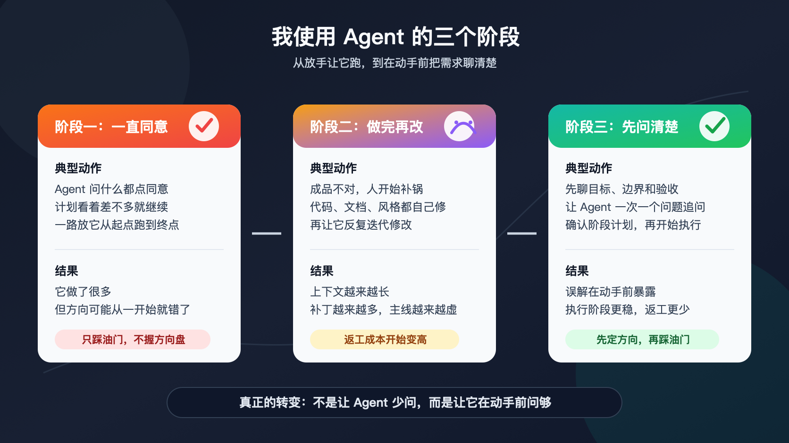
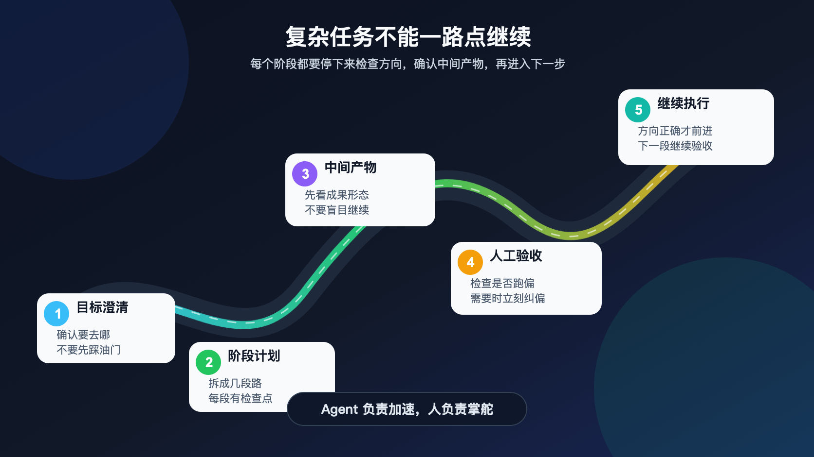
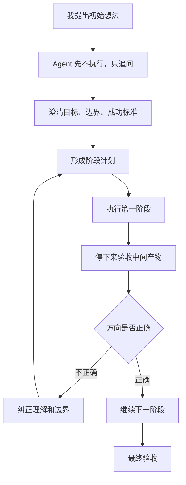

# Agent 很强，但人不能偷懒

刚开始认真使用 Agent 的时候，我犯过一个很典型的错误：我把它当成了一个可以自动理解我意图的执行系统。

它确实表现得很强。它会读代码、改文件、跑命令、总结问题，也会在动手前提出一些看起来很专业的方案。于是我很自然地形成了一种使用习惯：它问，我就同意；它说要继续，我就继续；它列出计划，我看着差不多，也直接批准。

整个过程很顺滑，甚至有一点爽感。好像我只要坐上车，剩下的事情它都会自动完成。

但结果经常并不理想。它确实做了很多事情，改了很多文件，输出了很多内容，可当我看到成品时，经常会意识到一个问题：

> 它执行得很努力，但方向不是我真正想要的方向。

这不是 Agent 没有工作，也不是它能力不够。问题恰恰出在它太能执行。一旦方向没有被确认清楚，它会沿着一个模糊甚至错误的理解持续推进，等我发现不对时，返工成本已经变高了。

## 第一阶段，同意同意同意同意同意

最早的时候，我对 Agent 的期待很简单：我提出需求，它负责完成。

这个期待听起来没有问题，因为 Agent 的价值本来就是帮助人完成任务。但实际使用之后，我很快发现，真正的问题不在于它能不能做，而在于我自己是否把需求讲清楚了。

我原本以为自己已经表达清楚，也以为 Agent 能自然理解我的意图，甚至能补全那些我没有说出口的边界。但事实是，Agent 只能根据上下文推断你的需求；没有被明确表达的部分，它会用自己的默认理解补上。

你没有说清楚目标，它就会自己定义目标。你没有定义边界，它就会按默认路径继续。你没有给出验收标准，它就会自己判断什么叫完成。

这时候最危险的，不是 Agent 能力不够，而是它执行力太强。能力弱的工具跑不远，出错也容易被及时发现；能力强的 Agent 一旦方向错了，反而会非常认真地把错误方向推进到底。

回头看，我当时一直点同意，本质上就是只踩油门，不握方向盘。车的马力很足，冲劲也很强，但前方如果有弯道，人不打方向盘，它不会自动知道你心里想去哪里，只会沿着当前方向继续往前冲。

Agent 也是一样。它跑得越快，方向错误时偏离得越远。

## 第二阶段，做完以后我自己改

意识到结果不对以后，我进入了第二种使用方式：Agent 做完以后，我自己改。

代码不对，我自己修；文档风格不对，我自己调；交互细节有问题，我自己补。这个阶段让我很快产生了挫败感，因为我发现自己花了大量时间给 Agent 收尾，有时甚至会觉得，如果最后还是要我亲自改，那还不如一开始就自己写。

后来我意识到，这也是一种误用。

如果 Agent 写完以后，每次都是人直接接手修改，那么人就变成了 Agent 的补丁工。Agent 只是把一个半成品交出来，最后真正保证质量的人仍然是自己。

更合理的方式，是把问题反馈给 Agent，让它自己修正。哪里不对，为什么不对，真正想要的结果是什么，都应该重新告诉它，让它沿着反馈继续迭代，而不是人直接接管所有细节。

这一步对我来说是一个明显的转变。Agent 不应该被当成一次性生成器，而应该被当成一个可以继续沟通、继续修正的协作者。

不过，这个阶段仍然不是终点。

### 反复修改，也会把事情带偏

让 Agent 自己修改，当然比人亲自替它收尾更合理。但我很快又遇到一个新的问题：反复修改并不一定会让结果越来越接近预期。

有时候，它改来改去，最终仍然没有满足需求。更麻烦的是，修改轮次越多，上下文越长，历史包袱越重，结果反而更容易变差。

前面写过的方案、被否掉的想法、临时补充的要求、某一次修 bug 时引入的妥协，都会留在对话里。这些信息混在一起以后，Agent 可能记住了很多细节，却没有真正抓住主线。

这很像一个项目一开始方向没有定清楚，后面只能靠不断打补丁往前走。短期看似还能运行，但越往后越难维护，越难收束。

所以问题不只是“做完以后怎么改”，而是能不能在动手之前，把方向尽可能讲清楚。

> 与其在后面反复修正，不如在一开始就把目标、边界和验收标准聊清楚。

这是我使用 Agent 方式的第二次转变。我不再急着让它动手，而是先让它提问。

## 第三阶段，动手之前先聊很久

现在遇到复杂任务时，我更习惯先和 Agent 进行充分沟通，而不是马上进入执行。

我会明确告诉它：先不要做，先问问题。一次只问一个问题。等我回答以后，再根据新的信息继续追问。直到它对目标、原因、边界、成功标准和不该做的事情有足够清楚的理解，再开始进入执行阶段。

有时候这个过程会持续很久。一两个小时并不罕见。我经常上午到公司以后，先不让 Agent 写代码，也不让它改文章，而是先和它讨论需求。等方向基本清楚，它开始干活，我再去处理别的事情。

表面看，这种方式比直接开干更慢。但从整体成本看，它往往更快。因为它减少了后续返工，减少了上下文污染，也减少了那种“看起来做了很多，但不是我要的”的失控感。

后来我发现，这种做法也有外部参照，比如 [Grill Me](https://github.com/jiyeol-lee/dotfiles/blob/main/.opencode/skills/grill-me/SKILL.md)。它的核心思路是在实现之前，通过深入追问理解用户需求、上下文、成功标准、边界条件和风险。

[superpowers](https://github.com/obra/superpowers) 也是类似逻辑：先理解上下文，一次问一个澄清问题，提出方案和取舍，拿到用户确认之后再执行。

这些方法都指向同一个模式：

> 不是让 Agent 少问问题，而是让它在正确的时间问足够多的问题。

真正浪费时间的，不是前面问得细，而是前面没有问清楚，后面进入高成本返工。

### 这不是问答游戏，是平等沟通

需要注意的是，让 Agent 先问问题，并不意味着把协作变成一个固定的问答表单。

更好的状态不是“Agent 给出几个选项，人从 A/B/C 里选一个”，而是双方围绕问题本身进行持续沟通。Agent 可以提问，也可以给建议；它可以列出几种方案和各自代价，但人不一定要在这些选项里做选择，也可以提出新的方案，或者继续要求它展开更多可能性。

在这个过程中，Agent 的问题经常会反过来帮助我发现自己没有想清楚的地方。它的建议也可能启发我调整方向。很多需求并不是一开始就完整存在于我脑子里，而是在反复追问、回答和修正中逐渐变得清晰。

所以，前期沟通不是额外成本，它本身就是设计过程的一部分。

Agent 的价值不只是执行，也包括帮助人把模糊想法整理成可执行的需求。但这个过程必须有人真实参与。人不能只把选择权交给 Agent，然后等待它自动理解真实目的。

### 不能让 Agent 替你拥有目的

Agent 能力越强，人越容易产生一种错觉：既然它能完成这么多事情，是不是也可以把目标、边界和取舍一起交给它？

甚至有人会设想，让两个 Agent 互相问答，一个负责追问，一个负责回答，最后自动生成需求。这种方式在某些低风险、低个人判断的场景里也许有用，但它不能替代真正的需求澄清。

因为你到底想要什么，只有你自己知道。

你的审美边界、业务判断、项目取舍、不可接受的结果、真实使用场景，都不是凭空存在于 Agent 里的。Agent 可以追问、整理和推演，但它不能替你拥有目的。

有些过程不能简单并行替代。需求澄清就是这样的过程。人的真实意图需要被表达、被追问、被修正，然后逐渐成形。如果这一步偷懒，后面再多 Agent，也只是更快地把模糊需求执行成模糊结果。

所以我现在越来越相信一句话：

> 该人做的事情，人不能偷懒。

这不是说人要亲手写每一行代码、修改每一个字、完成每一个页面。真正不能偷懒的是目标判断、边界定义、验收标准和方向控制。

这些事情如果人不做，Agent 不会自动替你做对。

### 复杂任务一定要分阶段验收

动手前把需求聊清楚，只是第一步。对于复杂任务，执行过程中还必须分阶段验收。

我现在会要求 Agent 把任务拆成多个阶段，每个阶段完成后都停下来，让我检查中间产物。这里的检查不是形式上的“继续”，而是认真判断当前结果是否符合预期：设计方向是否正确，代码是否符合边界，文章语气是否跑偏，交互是否和原始目标一致。

越复杂的项目，越不能从起点一路放到终点。因为复杂任务不是一条直线，中间会有很多弯道，每一个弯道都可能开始偏航。

开车这个类比在这里很准确。

开车前，人必须先知道自己要去哪里。路不熟没关系，可以开导航，但不能连目的地都没有，就把油门踩下去。

开起来以后，也不能只踩油门不握方向盘。车越好，速度越快，人越要控制方向。前面有弯道，如果不打方向盘，车就会冲出去。

Agent 也是一样。它可以执行、加速，并且带你跑得很远。但目标、边界、路线选择和每一次转向，都必须由人来确认。

人不能偷懒，不是说人要亲自完成所有劳动，而是说人不能放弃掌舵。

### 我现在怎么和 Agent 协作

如果把我现在的使用方式整理成一个流程，大概是这样：

这套流程看起来比直接开干更麻烦，但它解决的是一个更根本的问题：Agent 可以执行任务，却不能替人定义目的。

过去我把 Agent 当成全自动工具，希望它自己理解、自己规划、自己做对。现在我更愿意把它当成一个能力很强的协作者。

协作者的意思是，它能完成大量具体工作，也能提出有价值的问题，但人必须在场。人需要解释意图，确认理解，检查关键中间产物，并在方向不对时及时纠偏。

这不是降低效率，而是在保护效率。

## 结尾

我现在越来越觉得，使用 Agent 最大的误区，不是低估它的能力，而是高估它对人类意图的理解。

它确实可以写代码、改文档、生成图片、跑命令、查资料、整理结构、实现功能。它的执行能力越强，人越不能在目标和边界上偷懒。

因为一旦人偷懒，它就会带着模糊需求高速前进。最后的问题往往不是它没有做，而是它在错误方向上做得太认真。

Agent 是发动机，是车，也是加速器。

但目的地不是它决定的，方向盘也不能交出去。

真正会用 Agent 的人，不是一路点同意的人，而是知道什么时候沟通、什么时候纠偏、什么时候验收、什么时候停下来重新想一想的人。

Agent 很强，所以人更要清醒。
