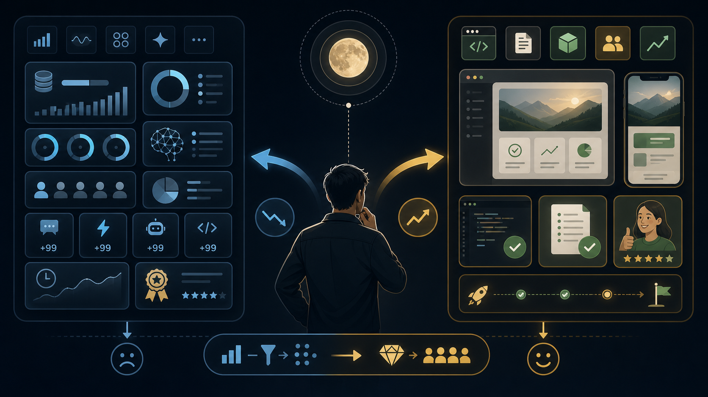

# Agent 是手段，而非目的

每次一个新的 Agent 工具被讨论起来，都会出现一段明显的兴奋期。比如围绕 OpenClaw 这类 Agent 项目展开讨论时，很多人的第一反应都是先上手试一试，看看它到底能把事情推进到什么程度。

很多人会尝试让它写代码、改文档、接 MCP、跑工作流、调用各种外部工具。这个过程当然很正常。一个新工具突然展现出很强的执行能力，人天然会想知道它到底能做到什么程度。

但我最近越来越强烈地感觉到，围绕 Agent 的很多讨论，正在发生一种轻微的偏移。

大家开始过度关注工具本身，关注它用了什么模型、接了多少工具、消耗了多少 token、能不能自动跑完整个流程，却不再那么认真地问一个更基础的问题：

> 我们到底要用它完成什么事情？

如果这个问题被放到后面，Agent 就很容易从手段变成目的。人会越来越关心自己有没有用上最新工具、有没有进入某种所谓的深度使用状态，却忘了工具最终应该服务于具体需求、具体功能和具体结果。

## 工具热潮很容易让人盯错地方

Agent 的能力越强，人越容易被它本身吸引。

这一点并不奇怪。过去很多工具只是提高某个局部效率，比如更快地补全代码、更方便地搜索资料、更顺手地整理笔记。现在的 Agent 看起来像一个完整的执行者，它可以读上下文、拆任务、改文件、跑命令、总结结果，甚至在某些场景里自己完成多轮迭代。

于是，人的注意力很容易被拉到工具能力上。

今天讨论这个 Agent 能不能自动修 bug，明天讨论那个 Agent 能不能一次性生成完整项目，再过几天讨论某个工作流能不能把人从中间完全拿掉。讨论本身没有问题，这些能力确实值得研究。

问题在于，如果注意力长期停留在工具层，事情就会逐渐变形。

一个团队原本应该关心的是需求是否被解决、产品是否变好、代码是否可维护、用户是否真的获得价值。可一旦工具本身变成中心，大家就会开始用一些很容易量化、但未必真正重要的东西来证明自己正在拥抱 AI。

比如用了多少 token，开了什么级别的会员，接入了多少工具，工作流看起来有多复杂，代码里有多少比例是 AI 生成的。

这些数字看起来很有管理感，也很适合被放进周报、复盘和汇报里。但它们最多只能说明“工具被使用了”，并不能直接说明“事情被做好了”。

## 以手指月，真正要看的不是手指

禅宗里有一个很经典的说法，叫以手指月。

一个人用手指指向月亮，是为了让你看到月亮。手指本身只是引导。如果你把全部注意力都放在手指上，开始研究手指的角度、形状、姿势、动作，反而会错过真正要看的东西。

我觉得这个类比很适合用来理解 Agent。

Agent 是那根手指，真正的月亮是我们要完成的事情。

可能是一个功能，一个文档，一段可维护的代码，一个更清楚的产品方案，也可能是一次更高效的内部协作。Agent 的价值不在于它自身有多复杂，而在于它有没有把人带到更接近目标的位置。

如果一个人用 Agent 写了很多代码，但这些代码没有解决问题，后续也难以维护，那么“AI 参与比例很高”这件事没有太大意义。

如果一个团队用 Agent 生成了大量文档，但读者看完仍然不知道项目该怎么做，那么“文档生成效率提升”也只是表面繁荣。

如果一个工作流看起来非常自动化，从需求到实现再到总结全都能跑起来，但最后交付出来的东西没有通过真实验收，这个工作流再漂亮，也没有真正闭环。

手指可以很重要。没有手指，很多人可能根本看不到月亮。但手指不能取代月亮。

## 指标会制造“深度使用”的错觉

现在有一种很常见的倾向，是用工具使用指标来判断一个人或一个团队是否真的在使用 AI。

比如看一个人每天消耗了多少 token，看他是否开了最高级别的会员，看他用了多少 Agent 工具，甚至看一段代码里有多少比例由 AI 生成。

企业里也容易出现类似冲动。管理者希望推动 AI 落地，希望员工真正用起来，于是很自然地会寻找可以量化的指标。比如要求 AI 生成代码占比达到某个比例，或者要求团队在研发流程里必须接入某类 Agent。

这种管理思路可以理解。没有指标，很多事情很难推动。但指标一旦脱离结果，就会反过来制造错觉。

一个人消耗了很多 token，可能只是反复试错、反复让模型生成无效内容。一个团队 AI 生成代码比例很高，可能只是把大量低质量代码更快地写进仓库。一个人接了很多工具，也可能只是搭出了一套复杂但不稳定的流程。

这些都不能自动证明他更懂 Agent，也不能证明他创造了更高价值。

真正的“深度使用”，不应该只看工具使用强度，而应该看一个人是否能把 Agent 放进真实任务里，让它稳定地产生有价值的结果。

这里面至少包括几件事。

他是否知道什么任务适合交给 Agent，什么任务必须由人判断。

他是否能把需求讲清楚，让 Agent 不在错误方向上高速执行。

他是否能验收结果，判断代码、文档、设计或方案是否真的成立。

他是否能在结果不对时重新定义边界，而不是继续消耗更多 token。

这些能力很难被一个简单数字概括，却更接近真正的使用能力。

## 真正该衡量的是结果

如果把 Agent 放回“手段”的位置，衡量标准会变得更清楚。

写代码时，应该看功能是否正确，边界是否清晰，测试是否可靠，后续维护是否可控，而不是只看 AI 生成了多少行。

写文档时，应该看读者是否更容易理解，信息是否更准确，结构是否更清楚，而不是只看生成速度有多快。

做产品时，应该看用户是否真的用得更顺，需求是否被验证，体验是否变好，而不是只看原型是不是一天内做出来。

做研究时，应该看问题是否被推进，材料是否被正确组织，结论是否更可靠，而不是只看模型检索了多少网页、总结了多少页内容。

这些标准没有那么好量化，也没有 token、占比、调用次数那么直观。但它们才真正接近月亮。

工具指标可以作为辅助观察，帮助我们了解一个团队有没有开始使用 Agent，帮助我们发现流程里有没有新的效率空间。它们不适合作为最终目标。

一旦把辅助指标当成最终目标，人就会自然地优化指标，而不是优化结果。

这在软件工程里并不陌生。只看代码行数，会鼓励人写更多代码；只看需求数量，会鼓励人拆更多需求；只看会议纪要，会鼓励人开更多会议。到了 Agent 时代，只看 AI 使用比例，也会鼓励人生成更多东西，而不一定鼓励人把事情做得更好。

## 对个人来说，也要避免被工具牵着走

这件事不只发生在企业管理里，也发生在个人使用中。

很多人刚开始使用 Agent 时，都会有一个阶段，特别想证明自己“真的用起来了”。于是会尝试各种工具、各种工作流、各种插件，把流程搭得越来越复杂。

这当然也是学习的一部分。没有大量尝试，很难真正理解工具边界。

但过了探索阶段以后，最好还是回到一个朴素的问题：

> 这个工具到底有没有帮我把原本想做的事情做得更好？

如果答案是否定的，那就应该停下来调整，而不是继续堆工具。

有些任务只需要一次清晰的对话，不需要复杂工作流。有些任务只需要让 Agent 做资料整理，不需要让它全自动决策。有些任务最重要的是人的判断，Agent 只适合在旁边提供备选方案。

工具越强，越需要人保持清醒。否则人很容易被工具牵着走，从“我要完成一件事”变成“我要找一个场景证明这个工具很强”。

这时候，顺序已经反了。

## 回到目的之后，Agent 才真正有价值

我并不是反对关注 Agent 的能力。

恰恰相反，理解工具能力非常重要。只有知道它能做什么、不能做什么，人才有可能更好地使用它。对模型能力、上下文窗口、工具调用、代码执行、权限边界和工作流设计的研究，都很有价值。

但这些研究最终应该服务于结果。

Agent 应该让我们更快验证想法，更容易处理重复劳动，更低成本地探索方案，更稳定地交付复杂任务。它应该放大人的判断、经验和创造力，而不是取代人对目的的理解。

真正成熟的使用方式，应该是人先看见月亮，然后借助手指找到更好的路径。

人要知道自己想做什么，也要知道结果长什么样。Agent 可以帮助人走得更快、看得更远、做得更多，但它不应该变成全部注意力的中心。

最后真正值得证明的，不是你用了多少 Agent，也不是你消耗了多少 token，更不是你的代码里 AI 占比有多高。

真正值得证明的是：

> 你能不能用这些工具，做成一件真实、有用、可理解、可维护的事情。

Agent 是手段，而非目的。

这句话听起来很简单，但在工具能力快速膨胀的时候，越简单的判断，越需要反复提醒自己。
