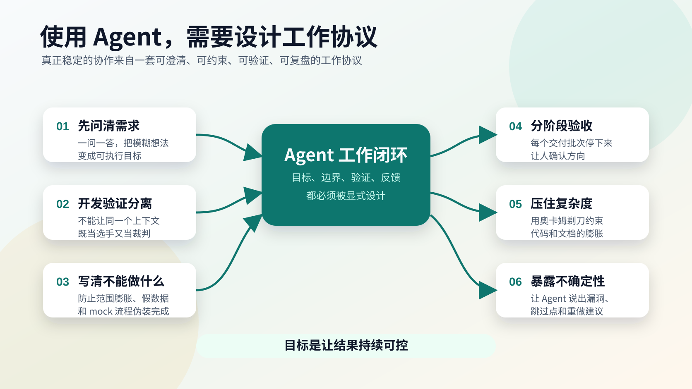
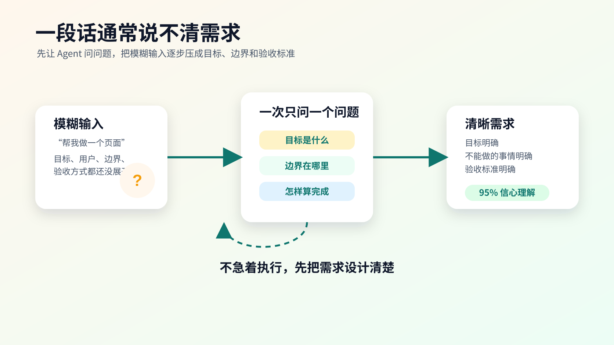
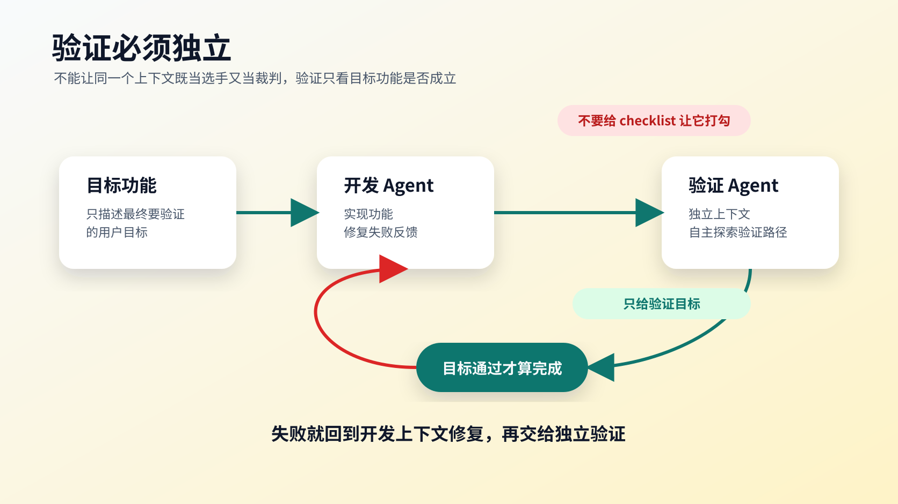
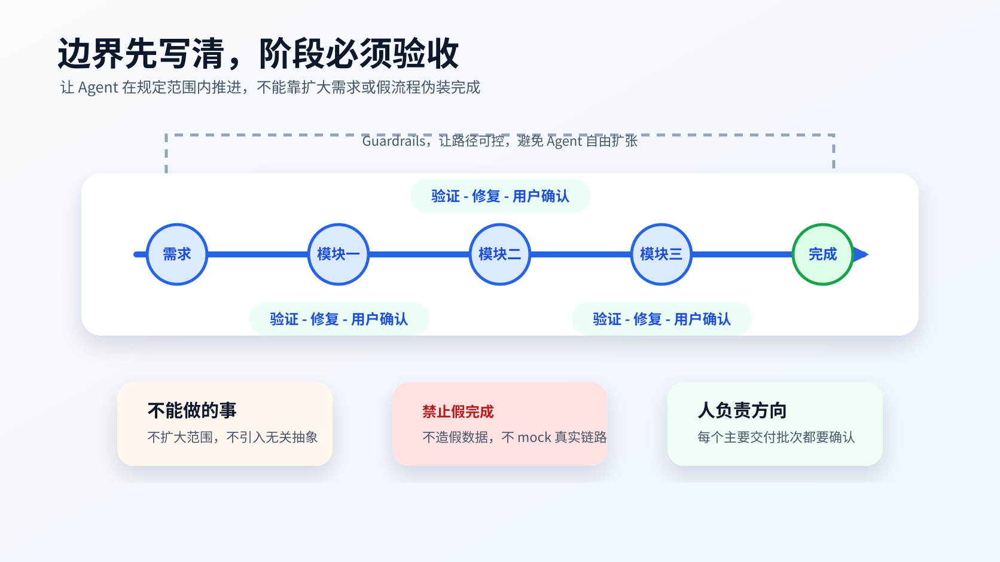
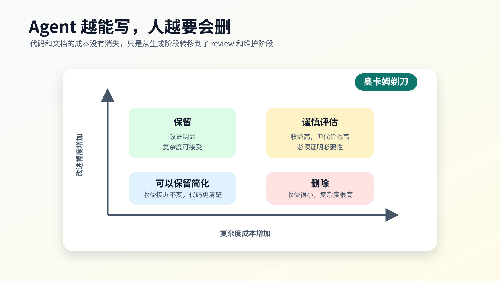
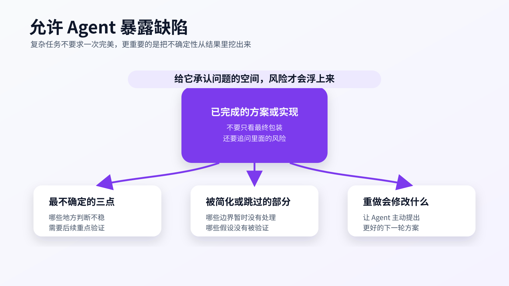

# 我现在使用 Agent 的六条实践原则



我现在越来越觉得，使用 Agent 最容易踩的坑，是把注意力过度放在 prompt 上，却没有把协作关系设计清楚。

很多人一开始用 Agent，会把重点放在一句话怎么写得更聪明、怎么让模型更听话、怎么让它一次性产出更多东西。但真正用到复杂任务里以后，我发现更关键的是一套稳定的工作协议。某个神奇句式能解决的问题很有限。

这套协议要解决几个问题。

需求一开始经常是不清楚的，所以 Agent 要先帮人澄清问题。实现过程中很容易跑偏，所以任务要分阶段推进。验证不能靠同一个上下文自证清白，所以开发和验证要分开。代码和文档很容易变复杂，所以要用奥卡姆剃刀压住。Agent 也不可能永远一次做对，所以要允许它暴露不确定性，再逐步修复。

下面这些算不上标准答案，只是我自己最近使用 Agent 时逐渐沉淀下来的几个实践。它们的目标，是让 Agent 更像一个可以协作、可以验收、可以持续修正的工程伙伴。

## 一、不要急着执行，先让 Agent 把需求问清楚



大部分场景下，一段话很难描述清楚自己的需求。

这件事我以前低估了。我以为自己把需求说出来了，Agent 就应该理解。后来发现，很多时候我只是说出了脑子里最显眼的部分，真正关键的边界、目标、验收标准、约束条件、用户场景，都还没有展开。

人自己经常也不知道哪里没想清楚。

比如我说“帮我做一个页面”，听起来像是一个需求，但里面其实有很多空白：这个页面给谁用，主要完成什么动作，信息层级是什么，哪些功能必须有，哪些功能不能做，风格要偏工具还是偏展示，最终怎么判断它完成了。

如果这些问题不先问清楚，Agent 就会自己补默认值。它可能补得很好，也可能补得离我的真实想法很远。更麻烦的是，它执行能力很强，一旦方向理解错了，就会非常认真地沿着错误方向推进。

所以我现在遇到稍微复杂一点的任务，第一步通常会让它先读材料、先提问，等方向清楚之后再动手。

我会这样跟 Agent 说：

```text
先查看相关材料，然后问我问题。

一次只问一个问题。

根据我的回答继续追问，直到你有 95% 的信心理解我要做的事情。

在你达到这个信心之前，不要开始执行。
```

这个做法的价值并不止于减少返工。它还会帮助我发现自己没有想到的点。

Agent 问出来的问题，有时会暴露需求里的模糊区域。比如它问“这个功能成功的标准是什么”，我才意识到自己只说了要做什么，却没有定义做到什么程度算完成。它问“哪些现有逻辑不能动”，我才意识到这个需求其实有一条很重要的边界。

所以，前期追问本身就是需求设计的一部分。

## 二、验证必须独立，不能让同一个 Agent 既当选手又当裁判



在 harness 里，验证流程是整个闭环的关键。

我现在很重视这一点，因为 Agent 很容易自我说服。它写完代码以后，再让它自己检查，当然也能发现一部分问题。但如果开发和验证都在同一个上下文里，它天然会带着实现时的假设去看结果。

这就像同一个人既参赛又给自己打分。

它知道自己本来想怎么实现，也知道自己刚刚做了哪些妥协。于是验证时很容易沿着实现路径检查，用户目标是否真的成立，反倒被放到了后面。

更好的方式，是把开发上下文和验证上下文分开。开发 Agent 负责实现，验证 Agent 负责从外部视角检查结果。验证 Agent 不应该知道太多实现细节，也不应该收到一份过于具体的 checklist。

这里有一个很容易反直觉的点：

> 不要把所有验证条目都列给验证 Agent。

因为所有验证条目通过，并不等于目标功能通过。

如果你给它一份很细的验证列表，它很可能只会逐条打勾。列表里的都过了，它就认为验证完成。但真实软件经常坏在列表之外。目标功能是否真的可用，用户路径是否真的顺，异常情况是否真的被处理，往往需要验证 Agent 自己去探索。

所以我更倾向于只给它最终需要验证的目标功能，让它自己设计验证路径。

我会这样要求：

```text
在所有需要验证和测试的步骤，都开启一个独立的 sub agent 去操作。

只提供给它测试目标，不要提供具体的测试和验证条目。

需要充分发挥独立 sub agent 的自主验证能力。

如果验证不通过，回到开发上下文继续修改，然后再次交给独立验证 agent。

持续这个循环，直到目标功能被完整验证通过。
```

这里的核心在于角色拆分，多开一个 Agent 只是形式。

开发 Agent 是选手，验证 Agent 是裁判。裁判可以自由设计检查方式，但最终目标功能必须通过，这一点是硬约束。

## 三、先定义不能做什么，避免 Agent 把需求越做越大



Agent 有一个很明显的倾向：它喜欢把事情做完整。

这听起来像优点，但在实际项目里经常会变成问题。你本来只是想做一个小需求，它可能会顺手加抽象、加配置、加兼容、加复杂状态、加额外入口，最后把一个很小的改动扩展成一套很难收尾的设计。

还有一种更危险的情况，是它为了让验证通过，使用 mock 数据、假流程或绕过真实链路。

这种行为短期看很“聪明”，因为测试能绿，页面能展示，demo 看起来能跑。但对真实项目来说，这相当于把问题藏起来。你以为功能完成了，实际上只是制造了一个能通过表面验收的假结果。

所以我现在会非常明确地告诉 Agent，除了要做什么，也要定义不能做什么。

我会这样写：

```text
除了要做的需求之外，尤其要定义好不能做的事情，避免偏离需求方向。

不要扩大需求范围，不要引入和当前目标无关的抽象、框架或复杂机制。

不允许制造假数据或者 mock 流程来通过验证。

如果真实链路现在无法完成，可以直接说做不到，或者说明缺少什么条件。

不会做没关系，我们继续沟通解决，不要用假实现伪装完成。
```

这段话背后其实是一个很朴素的工程原则：宁可暴露问题，也不要伪装完成。

Agent 做不到某一步，这并不可怕。真正可怕的是它用一个漂亮但虚假的实现，把问题藏进项目里。等到后面进入真实使用或 review 阶段，人再发现这件事，成本会高很多。

所以我宁愿它坦诚说“这里我不确定”“这里缺少真实接口”“这里不能靠当前上下文完成”，也不希望它为了显得能干，给我一个看起来完成的假结果。

## 四、复杂需求要分阶段推进，每一步都让人验收

开发和验证 Agent 的闭环，可以解决很多逻辑和流程问题，但它不能替代人的需求判断。

这点非常重要。

验证 Agent 可以告诉你功能是否按目标运行，测试是否通过，流程是否能走通。但它未必知道这个中间产物是否符合你真正想要的设计，也未必能判断需求方向是否发生了微妙偏移。

复杂需求往往很难一次性想清楚。人在看到中间产物之后，才会发现自己原来还在意某个交互细节，或者某个文案不符合预期，或者某个模块的优先级需要调整。

如果这个过程中人偷懒，一路点继续，最后很可能得到一个“逻辑上完成，和我想要的结果不一致”的东西。

所以我现在更倾向于分阶段推进。

我会要求 Agent 这样执行：

```text
分阶段推进。

每个模块完成之后，都要走验证-修复循环。

每完成一个主要部分或交付批次，都需要停下来让我确认。

如果不符合预期，我会补充需求或修正方向，你需要继续修改。

只有在我主动确认这一阶段验收完成后，才能进入下一模块开发。
```

这套流程看起来会变慢，但实际经常更快。因为它把偏航控制在小范围里。

如果一个需求分成五个阶段，每个阶段都停下来确认一次，那么问题通常会在局部暴露。反过来，如果从第一步一路做到最后，中间不验收，一旦方向错了，返工就会变成系统性返工。

人仍然要在场。

人不需要亲手写每一行代码，也不需要亲自跑每个测试，但方向、阶段结果、需求取舍和最终验收，必须有人负责。

## 五、写代码和文档时，要用奥卡姆剃刀压住复杂度



Agent 现在写代码太快了，几乎让人产生一种“代码没有成本”的错觉。

但代码写出来以后，事情还没有结束。它最终要被人 review、理解、维护、修改、负责。Agent 把生成成本降下来了，成本并没有消失，只是转移到了 review 和维护阶段。

这也是我现在越来越在意代码和文档可读性的原因。

Agent 很喜欢长篇大论。写文档时，它会把能想到的内容都写进去；写代码时，它也容易加很多“看起来更完整”的设计。那种感觉很像一个懂很多知识的人站在舞台上炫技，什么都想展示一下。

对一次性 demo 来说，这可能无所谓。但如果是稍微复杂一点的项目，或者你对代码质量有一点追求，有一点极客精神，就不能任由它这样膨胀。

我会明确要求它遵守奥卡姆剃刀：

```text
写文档或代码时，必须遵守奥卡姆剃刀原理，如无必要，勿增实体。

在其他条件相同的情况下，越简洁越好。

如果改进幅度很小，却增加了明显复杂性，那就得不偿失。

如果移除某些内容后能获得相同或更好的结果，那就是更好的方案。

评估是否保留某项更改时，要权衡复杂性成本和改进幅度。

如果性能只提升 1%，却增加了几百行难以维护的代码，通常不值得。

如果删除代码后性能更强，或者可读性更好，应该保留删除后的方案。

写文档也一样，把必须的点讲清楚，不要增加冗余内容。
```

这段要求的重点是控制无意义的复杂度。

这并不要求删除所有抽象和复杂度。复杂系统当然需要复杂设计。关键在于，每一层复杂度都要证明自己的必要性。

如果一个抽象能显著降低重复、隔离变化、提高可维护性，那它值得存在。如果一个抽象只是为了显得设计更完整，让人多绕几层才能看懂，它就应该被砍掉。

Agent 越能写，人越要会删。

这会成为未来非常重要的工程能力。

## 六、允许 Agent 暴露缺陷，再逐步修复



还有一个实践，我觉得很重要：允许 Agent 没有一次性完成需求。

很多人使用 Agent 时，会潜意识里希望它一次就给出完整答案。Agent 也会迎合这种期待，表现得很确定、很完整，好像所有事情都已经考虑到了。

但复杂任务里，一次做对并不现实。Agent 会漏东西，会误判，会简化某些边界，也会在不确定时给出一个看起来还不错的方案。

真正关键的是缺陷能不能被暴露出来。

所以我现在会在方案设计或实现完成之后，让它主动反思自己的不确定性。

我会这样问：

```text
在方案设计或实现完成之后，请你回答几个问题。

这个工作中你最不确定的三个点是什么？

哪些地方被你简化或者跳过了？

如果让你重做一遍，你会修改什么内容？

允许你有漏洞和失误，后续我们慢慢修复就行。
```

这段话的作用，是给 Agent 一个“承认问题”的空间。

如果你一直要求它完美，它就更容易把输出包装得很完整。如果你明确告诉它可以有漏洞，可以有不确定，可以后续修复，它反而更可能把真正需要注意的地方说出来。

这对复杂任务很有帮助。

很多风险不会直接出现在最终结果里。它们常常藏在“我这里其实跳过了一步”“我这里默认了一个条件”“我这里没有验证真实数据”“我这里为了赶进度用了简单方案”里面。

把这些地方挖出来，后续才有机会真正修。

## 结尾

回头看，我现在使用 Agent 的方式，核心其实只有一个变化：

我现在很少把它当成一个一次性生成答案的工具，更多会把它放进一个有目标、有边界、有验证、有反馈的协作闭环里。

先澄清需求，再分阶段执行。开发和验证分开，不能自我证明。明确能做什么，也明确不能做什么。人要验收关键中间产物，不能一路放行。代码和文档要克制，不能让生成能力变成复杂度来源。最后，还要允许 Agent 承认自己哪里不确定，再慢慢修复。

这些做法看起来都不神奇。

但我越来越相信，真正好用的 Agent 工作流，往往依赖这些很朴素的工程约束。某一句万能 prompt 解决不了长期协作问题。

Agent 的能力越强，人越要把协作规则设计清楚。

否则它确实会跑得很快。

只是未必跑向你真正想去的地方。
