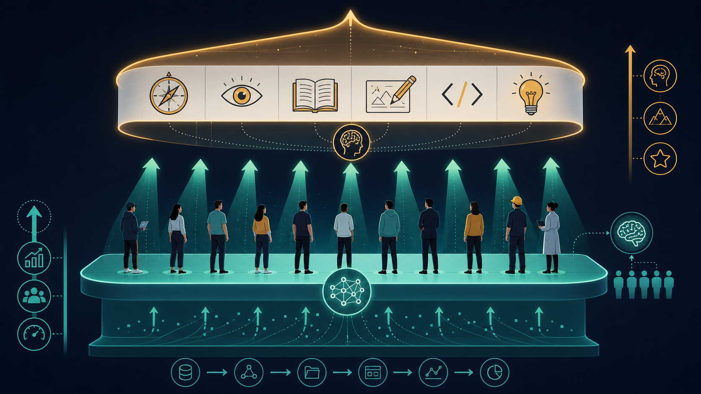

# AI 提高下限，但人决定上限

我曾经对 AI 有过很强的不安感。

当它开始写代码、画图、写文章、做总结时，那种压力很自然地出现了：如果一个工具能完成这么多过去只有专业人士才能完成的工作，人还剩下多少独特价值？

这种不安并不奇怪。一个工具突然具备大量专业能力，任何身处其中的人都会感受到冲击。尤其当它能写出一段可运行的代码，生成一张看起来不错的图片，或者把一篇文章整理得有模有样时，人很容易产生被替代的想象。

但真正把 AI 用到具体事情里之后，我的感受逐渐发生了变化。

它确实强大，却并不自动拥有目的、判断和品味。它能生成内容，也能快速完成许多执行性工作，但它并不总能直接满足真实需求。很多任务真正困难的部分，并不在“让它做”，而在“知道要让它做什么，以及判断它做得是否正确”。

理解越深入，恐惧感反而越弱。

AI 更像一种能力极强的工具，而非一个自然替代人的完整主体。

## 如果 Agent 能解决所有问题，差距在哪里

可以先做一个极端假设。

假设未来的 Agent 已经足够强，能够解决任何人类提出的问题。只要问题被明确交给它，它就能给出方案，完成执行，甚至交付结果。

即便如此，人的差距也不会消失。因为这里仍然保留着一个前提：

> Agent 能解决问题，但问题仍然要由人提出。

当执行能力越来越强，真正拉开差距的因素会转移到“谁能提出更好的问题”。一个人的认知、经历、学习内容、领域经验和判断力，决定了他能看到什么问题，也决定了他能提出什么问题。

同样使用一个 Agent，有的人只能提出普通需求，有的人却能提出更具体、更深入、更有价值的问题。最后得到的结果自然不同。

AI 会替代很多执行性工作，但它不会自动替代人的问题意识、价值判断和创造动机。

Agent 越强，提出问题的人越重要。

## AI 提高下限，人决定上限

AI 带来的一个重要变化，是它正在提升普通人能做事情的下限。

过去不会画画的人，很难做出一张像样的图。现在他可以用 AI 生成一批视觉效果不错的画面。过去不懂摄影、没有预算的人，很难做一个短片或 MV。现在他可以借助 AI 做出一个基本成型的视觉作品。过去不会写代码的人，很难做一个小工具。现在他可以让 Agent 帮自己搭出原型。

这是一种非常重要的能力普及。它让更多人第一次跨过“完全做不了”的门槛，让更多想法获得低成本尝试的机会。

这就是 AI 提高下限的意义。

下限提高，并不代表上限消失。

以画图为例，一个没有绘画训练的人可以用 AI 生成很多漂亮图片，但他未必知道这些图能否进入真实生产。构图是否成立，光影是否合理，风格是否统一，人物结构是否可靠，画面是否服务于表达目标，这些判断不会因为会写 prompt 而自动出现。

受过绘画训练的人使用 AI，结果通常不同。因为他在生成前已有构想，在生成后也有判断标准。他知道什么样的画成立，什么地方只是“看起来热闹”，什么地方实际经不起推敲。

同样的逻辑也存在于工程和设计里。AI 可以生成代码，懂工程的人会判断架构是否合理、边界是否清晰、长期维护是否会出问题。AI 可以产出界面，懂设计的人会判断信息层级、交互路径、视觉秩序和使用场景是否成立。

这里还涉及一个越来越重要的词：品味。

品味不止于“好不好看”，它是一种对结果质量的综合判断能力，包含审美、领域经验、用户理解、生产标准和取舍能力。

同样使用 AI 做一个产品，不同的人会得到完全不同的结果。有人会把页面堆满炫酷效果，动画、渐变、发光、卡片全部加上，画面看起来很热闹。也有人会选择更克制的表达，把信息层级、使用路径和视觉留白处理得更舒服。后者乍看没有那么强的冲击力，却更耐看，也更适合长期使用。

这就是品味的差异。

品味会直接影响产品风格、使用习惯和目标用户感受到的质量。给儿童使用的产品，可以更热闹、更夸张；给专业用户长期使用的工具，往往更需要安静、清晰、克制和稳定。AI 可以生成很多方案，但它不知道哪一种更适合具体用户、具体场景和具体目标。

AI 越强，品味越重要。

> 当生成变得廉价，判断就会变得更贵。

未来真正稀缺的能力，可能会从“能否生成”转向“能否判断生成结果是否成立”。有品味的人能更早看出问题，也能更明确地把 AI 拉回正确方向。

我更愿意这样理解 AI：

> AI 提高的是人类能力的下限，但真正的上限，仍然由人决定。

它让更多人能做出东西；至于能不能做得好，仍然取决于人的领域理解、审美判断、问题意识和责任感。

## 正确的方式，是理解边界

使用 AI 最重要的能力之一，是理解边界。

现在常见的两种极端，都不理想。

一种是过度恐慌。因为害怕被 AI 替代，干脆不用它，所有事情都坚持自己完成。这种方式看起来稳妥，实际会放弃大量效率提升，也会让自己越来越远离新的工作方式。

另一种是过度迷信。看到 AI 能做很多事情，就把目标定义、审美判断、方案取舍和最终责任全部交给它。结果往往是一开始很快，最后却产出大量不符合真实需求的内容。

更合理的方式，是重新划分人和 AI 的分工。

人负责目标定义、问题选择、边界判断、审美判断和最终验收。AI 负责生成、检索、整理、扩展、执行、重复劳动和初步方案探索。

如果人放弃自己该承担的部分，AI 会把模糊目标高速执行成模糊结果。如果人完全拒绝使用 AI，又会错过它带来的巨大杠杆。

好的使用方式，是人站在主导位置上，把 AI 当作放大器。

## 越理解，越不恐慌

现在我对 AI 的态度，比最开始平静很多。

这种平静来自更清楚地理解它强在哪里，也理解它的边界在哪里，并非低估它的能力。

它能放大一个人的能力，却不会替人拥有目的。它能降低很多事情的门槛，却不会自动生成高质量判断。它能从已有数据中学习、组合、推理和延展，但人的真实问题意识、生活经验、领域品味和创造冲动，仍然非常重要。

因此，没有必要把 AI 想象成一个恐怖的东西。

真正重要的，是学习如何和它分工。

人做适合人的事情，AI 做适合 AI 的事情。

从这个角度看，AI 并没有让人失去价值。它反而会逼迫人更清楚地理解，自己的价值到底在哪里。

越理解 AI，越不需要恐慌。

它不会替你拥有目的，它会放大你已经拥有的能力。
