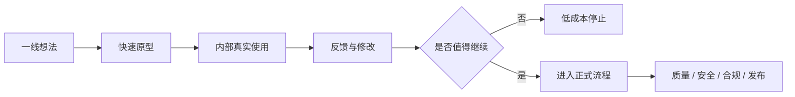
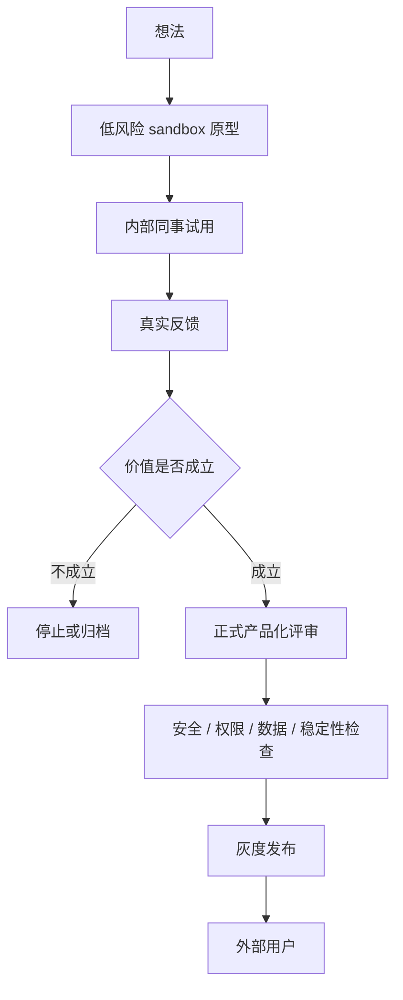

# Claude 员工为什么能把想法直接做成产品

最近我一直在想一个问题：当 AI Agent 已经可以把一个想法快速变成可运行原型时，公司内部的产品流程会不会被重新改写。

以前我们理解的产品开发，大多是一个很长的链条。产品经理先写需求文档，开需求评审；设计师出 UI，开设计评审；研发排期，开发，联调，测试，再经过一轮又一轮验证。这个流程当然有它的意义，尤其在大公司里，它可以管理风险，也可以让复杂协作变得可控。

但它的问题也很明显。

一个想法还没有被真实使用过，就已经在文档、会议和排期里被消耗了很多遍。等到它终于被开发出来，提出这个想法的人可能已经不再兴奋，团队也很难判断它到底是不是真的有价值。

我看到 Anthropic 公开介绍自己团队使用 Claude Code 的方式时，最打动我的并不是某个具体功能，而是一种新的工作形态：**有想法的人，可以更早地把想法变成东西，而不是先把想法交给流程。**

这件事看起来只是效率提升，但我觉得它背后其实是组织方式的变化。

## 一、传统流程的问题，不只是慢

传统产品流程的核心逻辑是分工。

产品负责定义问题，设计负责表达方案，研发负责实现，测试负责验证，安全和合规负责兜底。越大的公司，这套分工通常越细，因为每个环节都要对自己的风险负责。

这套机制在过去是合理的。没有 AI Agent 的时候，一个想法要变成可运行的产品，需要大量专业劳动。如果每个人都随便开干，项目很容易失控。

但在 Agent 出现之后，问题变得不一样了。

现在一个人可以用 Claude Code、Codex 或类似工具，在很短时间内做出一个可运行的 demo。它可能不完美，可能不稳定，也可能只是一个 sandbox 里的原型，但它已经足够让别人体验、试用和反馈。

这会改变讨论的起点。

以前大家围着需求文档争论：这个功能该不该做，交互是不是合理，技术成本会不会太高。

现在更好的方式可能是：先把一个最小版本做出来，让真实的人用一下，然后再讨论。

我不是说文档、评审、测试都不需要了。恰恰相反，越是要推给外部用户，后面的质量、安全、合规、稳定性审查就越重要。

但顺序变了。

> 过去是先用流程证明一个想法值得被做出来。现在更好的方式，是先用原型证明这个想法值得进入流程。

这句话是这篇文章的核心。

## 二、Anthropic 的公开案例里，已经能看到这个趋势

Anthropic 有一篇官方文章叫 [How Anthropic teams use Claude Code](https://www.anthropic.com/news/how-anthropic-teams-use-claude-code)，里面写了很多内部团队使用 Claude Code 的例子。

其中最有意思的地方，是 Claude Code 并不只被工程师拿来写代码。

产品设计团队会把 Figma 设计文件交给 Claude Code，让它写代码、跑测试、持续迭代。数据科学家即使不熟悉 TypeScript，也可以用它生成 React 应用来可视化 RL 模型表现。增长营销团队用它处理广告 CSV，生成大量广告变体。甚至法务团队也做过内部的 phone tree 原型，用来帮助同事找到合适的法务支持。

这些例子背后有一个共同点：**能描述问题的人，开始具备了直接构建解决方案的能力。**

这就很不一样。

在传统组织里，很多人其实只能“提出需求”。提出需求以后，他要等待别人理解、排期、开发。这个过程中会有大量信息损耗，因为真正知道问题的人，不一定是最终实现方案的人。

但如果提出问题的人可以先做一个原型，哪怕只是很粗糙的版本，信息损耗就会小很多。

他不再只是说“我想要一个东西”，而是可以直接拿出一个东西说：

> 我觉得大概应该是这样，你们先用一下，看这个方向对不对。

这时讨论会变得具体很多。别人不需要想象它是什么，也不需要在文档里猜需求，只要打开、使用、反馈。

## 三、这套方式为什么能激发人的主观能动性

我觉得这里最关键的变化，是员工从“流程里的一个角色”，变成了“能把想法推进到可验证状态的人”。

在传统流程里，一个人的边界通常很清楚。产品不要随便写代码，研发不要随便改设计，设计不要越过产品去定义需求。每个人在自己的职责范围内做事，这样组织比较容易管理。

但这种管理方式也会带来副作用：人的创造力被角色边界切开了。

一个设计师可能非常清楚某个交互应该怎么做，但他没有能力快速验证。一个运营可能非常清楚某个内部工具会节省大量时间，但他不能直接调工程资源。一个法务可能知道内部咨询流程哪里卡，但在传统流程里，这种需求很难排到优先级。

Agent 的出现，让这些人第一次有机会把自己的想法往前推一段。

不是推到 PPT，不是推到需求文档，而是推到一个能被别人打开使用的原型。

这个变化对组织很重要。因为很多真正有价值的小工具、小改进、小流程优化，往往不是从年度规划里长出来的，而是从一线使用者的具体痛点里长出来的。

如果组织只能处理“被正式立项的需求”，那大量细小但真实的需求就会被过滤掉。

而如果组织允许员工把想法先做成原型，再在内部流转，很多需求就会自己浮出来。

这不是流程少了，而是流程的入口变宽了。

这套机制最好的地方在于，它不会要求每个想法一开始就背负完整项目成本。

一个想法可以先小范围存在。如果没人用，它就停掉。如果大家都觉得有用，它再进入更正式的流程。

这比一开始就开大项目健康很多。

## 四、链路越短，人的价值感越强

这里还有一个很重要的点，是人的价值反馈。

一个人有了一个想法，然后自己把它做成原型，再交给别人试用，最后根据反馈继续修改。这个链路越短，他就越容易看见自己的价值。

因为结果是连在一起的。

想法是他的，第一版实现是他的，别人用完以后的反馈也是直接回到他这里。这个时候他不是在完成一小块任务，而是在推动一件完整的事情从无到有。

这种反馈会很强。

它会让人更愿意主动发现问题，也更愿意主动承担责任。因为他知道自己的判断不是被埋进一个巨大的流程里，而是有机会直接变成一个别人真的会用的东西。

这其实是创造力很重要的燃料。

很多时候，一个人不是没有想法，也不是不愿意做事，而是他很难从组织里得到足够清晰的价值回路。他做了一件事，但不知道最后有没有被用户用到；他修了一个点，但不知道这个点对整体体验有什么影响；他参与了一个大项目，但最终上线时，自己的那一小块已经被层层协作稀释掉了。

在大厂里，这种感受会更明显。

一个大需求会被拆成很多很小的需求，再继续拆成很多很细的开发任务。每个人只拿到其中一小段，做一个按钮、一个接口、一个状态、一个埋点、一个兼容逻辑。单个任务当然也有价值，但它离最终用户太远，离完整问题也太远。

再加上开发周期和上线周期都很长，价值反馈就会变得更弱。

你今天做的东西，可能一个月以后才上线。上线以后，也未必有人告诉你用户怎么用、效果怎么样、有没有解决问题。时间久了，人就很容易变成只对任务负责，而不是对问题负责。

这不是个人懒，而是反馈系统断了。

Agent 原型工作流真正有意思的地方，就在于它把这个反馈链路重新接短了。

> 从想法到实现，再到交付和反馈，这条链路越短，个人价值越容易被看见，人的主动性也越容易被激发。

所以我觉得 Claude 这种工作方式的价值，不只是更快做功能。它更像是在组织里重新建立一种“我能创造东西，而且我能看见它产生影响”的感觉。

这种感觉很珍贵。

## 五、为什么大厂很难直接变成这种模式

我觉得很多互联网大厂短期内很难完全切到这种工作方式，原因并不是它们不知道 AI 有用，而是它们原来的组织系统太重。

第一个问题是角色分工太细。

大厂里的项目通常有产品、运营、设计、前端、后端、客户端、测试、数据、安全、合规、项目管理。每个角色都有自己的职责边界，也有自己的审核链路。一个人想把想法直接做成东西，往往会碰到很多隐形门槛。

他能不能调用数据？能不能申请接口？能不能访问环境？能不能上线内部工具？能不能让别人试用？这些都不是单纯技术问题，而是组织权限问题。

第二个问题是资源审核太严格。

这也很正常。大公司用户多、数据多、风险高，不可能让所有人随便调用公司资源。但结果就是，很多小实验还没有开始，就已经被资源申请、安全规范和流程审批挡住了。

第三个问题，也是我觉得最现实的问题，是绩效压力。

在大厂里，每个人每周要写周报，每个季度要对齐目标，每半年或一年要面对绩效。一个部门新开一个方向，可能会迅速招很多人、花很多钱，但它也必须在很短时间内证明价值。如果半年或一年看不到结果，整个方向都可能被裁撤。

这会让人变得非常理性，也非常保守。

当绩效系统要求你证明自己有确定产出时，你自然更愿意做确定性的事情，而不是去探索一个不知道能不能成的方向。

这不是人的问题，是机制的问题。

探索本来就是不确定的。真正的新东西，一开始通常都不像 KPI。它可能只是一个内部小工具，一个粗糙 demo，一个看起来不太正式的实验。

但如果组织只奖励确定产出，就会慢慢惩罚探索。

所以大厂不是不能用 Agent，而是很难让 Agent 真正改变工作方式。它们可以把 Agent 加进旧流程里，提高某个环节的效率，却不一定能让“有想法的人直接做出原型”成为默认动作。

## 六、Claude 这套飞轮能转起来，一个关键前提是他们在用自己的产品

还有一个点，我觉得非常重要，而且经常被忽略。

Anthropic 的员工之所以能用 Claude Code 形成这种内部原型飞轮，一个很关键的条件是：他们自己就是 Claude 的深度用户。

他们不是站在用户外面想象需求，而是在自己的工作里真的使用 Claude。工程师用它读代码、修 bug、写测试；设计师用它做原型；数据科学家用它做可视化；营销、法务、运营也可以用它构建自己的内部工具。

这意味着内部反馈不是“模拟用户反馈”，而是真实使用里的反馈。

Anthropic 另一篇关于 [Labs](https://www.anthropic.com/news/introducing-anthropic-labs) 的公开说明里，也提到类似的产品动作：在 Claude 能力边界上实验，拿不成熟版本给早期用户测试，找到有效的东西，再把它扩展成可靠产品。

这套话如果放在普通公司里，可能听起来像创新口号。但在 Claude 这种产品上，它有一个现实基础：员工自己的工作场景，和外部用户的很多工作场景是相通的。

他们写代码，外部用户也写代码。

他们做文档，外部用户也做文档。

他们需要内部自动化，外部用户也需要自动化。

他们遇到的很多问题，不是“内部特供问题”，而是 AI 工具用户都会遇到的问题。

这就是 dogfooding 的价值。

很多公司做产品时，其实没有真正使用自己的产品。或者说，他们以为自己在使用，但只是浅层体验。产品经理点一下核心流程，设计师看一下页面，老板试一下 demo，然后大家就认为自己理解用户了。

但真正的深度使用不是“我打开过这个产品”，而是“我在自己的真实工作里依赖它，并且会因为它不好用而被卡住”。

只有到了这个程度，反馈才会变得锋利。

如果你不是深度用户，你提出的很多需求很容易变成想当然。它可能看起来合理，但没有真实场景压力。没有压力，就很难分辨什么是真需求，什么只是漂亮的功能想象。

所以 Claude 这套工作方式最值得看的地方，不只是他们有一个强大的 Agent，而是他们的员工刚好处在一个特殊位置：**他们既是产品建设者，也是产品的高强度使用者。**

这两种身份合在一起，原型飞轮才容易转起来。

## 七、这其实是在打破传统项目角色

传统项目里有一个默认假设：需求、设计、实现、验证，是不同角色顺序完成的事情。

但 Agent 让这个假设开始松动。

一个人不一定要完整替代所有角色，但他可以跨过一些低成本的边界，先把自己的判断变成可运行物。

产品可以先做出交互原型。

设计可以先验证状态逻辑。

数据科学家可以先做出可视化应用。

运营可以先搭一个自动化工具。

法务也可以先把内部咨询流程做成一个可试用系统。

这不是说大家都变成程序员，而是说“构建能力”开始扩散到更多岗位。

Anthropic 在那篇 Claude Code 团队案例里提到过一个判断：agentic coding 正在模糊技术与非技术工作的边界。这个判断我非常认同。

边界一旦变模糊，组织就会出现新的工作方式。

以前一个人提出问题以后，要把问题交给另一个角色处理。现在他可以先自己处理一部分，再把更具体的结果交给别人判断。

这会让协作关系从“请你帮我实现一个抽象需求”，变成“我已经做了一个粗糙版本，我们一起看它该不该继续”。

后者的讨论质量通常会高很多。

## 八、但这不代表所有流程都应该被取消

这里需要非常明确一点：我不是在赞美无流程，也不是说公司应该让所有人随便上线东西。

尤其是生产环境、用户数据、安全权限、付费系统、企业客户相关能力，这些东西不可能靠热情驱动。越是 AI 产品，越需要边界、评估和责任机制。

真正应该改变的，不是把流程全部砍掉，而是把流程放到更合适的位置。

原型阶段需要的是低摩擦。

发布阶段需要的是高标准。

内部试用阶段需要的是真实反馈。

外部上线阶段需要的是责任闭环。

这几个阶段不应该混在一起。

一个健康的 Agent 工作流，应该允许想法在低风险环境里快速出现，也应该阻止它在没有验证和审查的情况下进入高风险环境。

这和我前面写 Harness Engineering 时讲的东西其实是同一个逻辑。

自由不是没有边界。

真正好的自由，是在明确边界里快速探索。

## 九、普通团队能学什么

不是每家公司都能变成 Anthropic，也不是每家公司都适合照搬 Claude 的工作方式。

但我觉得普通团队至少可以学三件事。

第一，给员工一个可以安全做原型的环境。

这个环境不一定能访问生产数据，也不一定能直接上线，但它应该足够低摩擦。一个人有想法时，应该能在一两天内做出一个 demo，而不是先花两周申请资源。

第二，把“内部真实使用”变成判断标准。

不要只看需求文档写得漂不漂亮，也不要只看 demo 演示顺不顺。一个内部工具，如果真的有价值，应该能让同事愿意反复使用。反复使用比会议里的认可更可靠。

第三，让提出想法的人承担第一轮使用责任。

很多伪需求之所以会出现，是因为提出需求的人不用自己用。真正的好机制应该要求提出者自己先成为用户。只有他自己会被这个产品卡住、被这个流程影响，他的判断才会更接近真实。

如果这三件事能跑起来，一个小团队也可以获得类似的飞轮：

> 想法变原型，原型进内部使用，内部使用产生反馈，反馈决定是否产品化。

这比“先写一个完美需求文档，再等资源排期”更适合 AI Agent 时代。

## 十、未来的组织竞争，可能会变成原型速度的竞争

Anthropic 的 [AI 软件开发影响研究](https://www.anthropic.com/research/impact-software-development) 里有一个很有意思的数据：Claude Code 上的对话更偏自动化，而且在编码场景里，带有人类验证的 feedback loop 非常常见。研究还提到，初创公司是 Claude Code 的主要早期采用者之一，而企业采用相对滞后。

这个现象和我的直觉是一致的。

越轻的组织，越容易接受“先做出来再判断”。越重的组织，越容易把 Agent 放进旧流程里，只把它当成提效工具。

但 Agent 真正改变的，可能不是某个环节的效率，而是组织从想法到验证的速度。

谁能更快把真实问题变成原型，谁就能更快获得反馈。

谁能更快获得反馈，谁就能更快知道什么值得继续，什么应该停掉。

最后竞争的可能不是谁写了更多需求文档，也不是谁开了更多评审会，而是谁能让员工的判断更快接触真实世界。

我觉得这才是 Claude 员工工作方式最值得观察的地方。

它不是单纯的敏捷，也不是传统意义上的“人人都是产品经理”。它更像是一种新的组织能力：让更多人拥有构建原型的能力，同时用真实使用和后续流程把这种能力收束起来。

如果说过去的互联网公司是在管理项目，那么 AI Agent 时代的公司，可能要开始管理原型飞轮。

真正重要的问题也会变成：

你的组织里，一个普通员工有一个好想法时，他到底能走多远？

他只能写进周报里，等下一次评审。

还是可以在安全边界里，把它做出来，让别人用一下。

这两个答案，可能会决定一个组织能不能在 AI 时代继续保持创造力。
