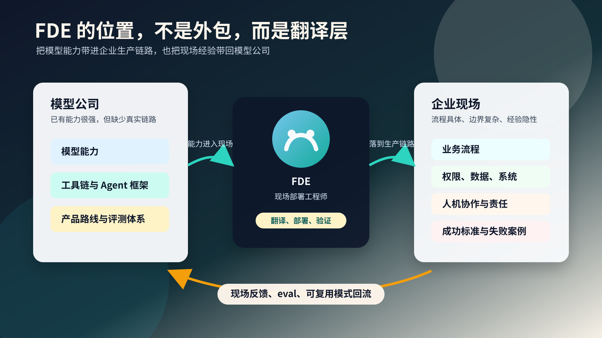
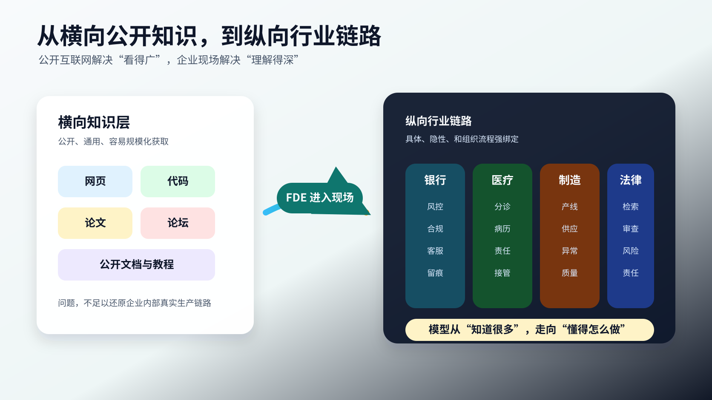
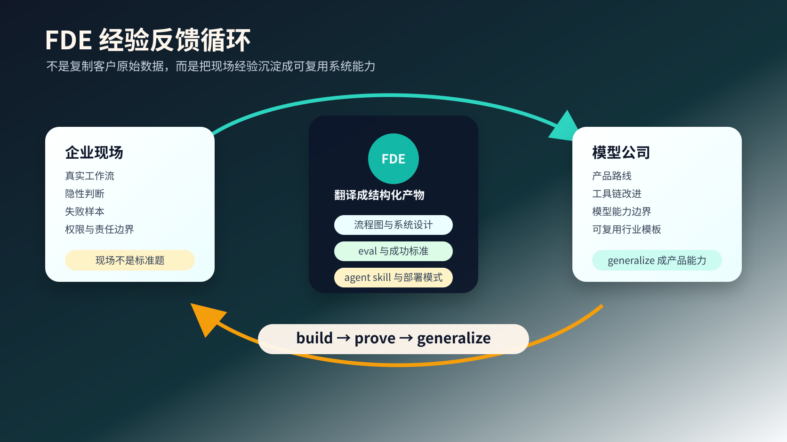

# 可能隐藏在FDE工程师背后的战略意图

最近 FDE 这个词突然变得很热。

这里说的 FDE，是 Forward Deployed Engineer，直译过来有点像前线部署工程师。这个岗位不是传统意义上的纯研发，也不是单纯的售前或售后。它更像一种被派到客户现场的复合型工程角色，要懂模型、懂工程、懂业务沟通，还要能在高不确定性的真实环境里，把 AI 系统做进生产链路。

这件事之所以值得单独拿出来聊，是因为 OpenAI 和 Anthropic 都在明显加码这类岗位。

OpenAI 在 2026 年 5 月 11 日发布公告，宣布成立 [OpenAI Deployment Company](https://openai.com/index/openai-launches-the-deployment-company/)，并表示将收购 Tomoro，从一开始就带来约 150 名 Forward Deployed Engineers 和部署专家。OpenAI 对这个新公司的描述很直接，它要把专门做前沿 AI 部署的工程师嵌入到组织里，帮助企业围绕关键工作流重新设计系统。

Anthropic 也在招聘 [Forward Deployed Engineer, Applied AI](https://www.anthropic.com/careers/jobs/4985877008)。它的岗位说明里写得更具体，FDE 要嵌入战略客户，和客户团队一起交付基于 Claude 的生产应用，还要交付 MCP server、sub-agent、agent skill 这类会进入生产工作流的技术产物。

如果只从外面看，这个岗位有点像高级外包。

客户不知道怎么把 AI 用起来，于是大模型公司派工程师过去，帮它接系统、做 Agent、改流程、上线应用。客户得到效率提升，OpenAI 或 Anthropic 得到企业收入，看起来是一个很自然的双赢。

但我觉得，FDE 真正重要的地方，不只在交付。

它更像大模型公司进入真实世界的一种方式。

## 一、Agent 很强，但不能直接跳进企业生产链路

今天的 Agent 能力已经非常强了。

它能写代码、查资料、调用工具、分析文档、生成方案，也能在很多标准任务里表现得像一个非常能干的执行者。站在普通用户视角看，很容易产生一个直觉，既然 Agent 已经这么强，那企业只要把它接进内部系统，不就能马上提效了吗。

但真实情况没这么简单。

企业内部的生产链路不是一道标准题，也不是一篇公开网页。它通常是一套长期演化出来的系统，里面有权限、流程、责任、例外情况、历史包袱，也有大量没有被写成文档的隐性规则。

同样是销售转化，ToB 软件、保险、汽车、房地产、医疗器械，客户旅程、合规要求、决策链路、话术习惯和风险边界都不一样。同样是客服，银行客服、电商客服、航空客服、医院客服，能自动化的部分、不敢自动化的部分、必须留痕的部分，也完全不是一回事。

甚至同一个行业，不同国家、不同地区、不同公司，内部系统和流程也会长得很不一样。

一个 Agent 在 benchmark 上看起来很强，但你真的把它放进企业生产链路里，它立刻会遇到一堆很具体的问题。

权限怎么给。

数据从哪里来。

错误由谁负责。

什么时候必须让人接管。

什么叫做这次任务成功。

这些问题，公开互联网没有现成答案。

这也是为什么企业 AI 落地经常卡在最后一公里。模型能力本身已经足够强，但它要进入真实业务，还必须理解一个组织的具体工作方式。

这中间缺的不是一个更漂亮的 demo，而是一种把模型能力翻译成生产系统的能力。

## 二、FDE 的表面工作，是把 AI 从 demo 做到生产

OpenAI 对 FDE 的定义很有意思。在 [OpenAI Deployment Company 的页面](https://openai.com/business/the-openai-deployment-company/)里，它说 FDE 不是从通用产品开始，而是直接和客户一起解决具体问题，验证影响，然后识别可以规模化的模式。

这一句话里，其实包含了 FDE 的三层工作。

第一层是发现问题。FDE 要和客户里的业务负责人、技术团队、一线员工一起，把「我们想用 AI 提效」拆成一个具体问题。比如到底是客服响应慢，还是销售跟进质量不稳定，还是合规审查占用太多人力。

第二层是构建系统。FDE 不是只给建议，而是要真的设计、开发、测试、部署，把模型接到客户的数据、工具、权限和业务流程里。OpenAI 的 FDE 职位描述里也写到，这个岗位要负责从 discovery、technical scoping、system design 到 build 和 production rollout 的端到端部署。

第三层是验证影响。OpenAI 的职位描述强调，FDE 的成功要通过 production adoption、measurable workflow impact 和 eval-driven feedback 来衡量。也就是说，FDE 不是把系统上线就结束，而是要证明它真的被使用，真的改变工作流，真的产生可测量的业务影响。

所以 FDE 并不是传统意义上交付一个项目文档的人。

它更像一个站在客户现场的产品工程师。

它要把模型能力从「理论上能做」变成「在这个组织里每天都能稳定工作」。

## 三、真正稀缺的不是通用知识，而是垂直链路

如果只看模型能力，过去几年大模型已经吃下了非常多公开知识。

公开网页、代码、论文、书籍、论坛、问答社区，这些内容构成了早期大模型能力扩张的基础。Epoch AI 在一篇关于训练数据瓶颈的研究里估算，经过质量和重复调整后，可用于 AI 训练的人类公开文本大约在 [300 万亿 token](https://epoch.ai/blog/will-we-run-out-of-data-limits-of-llm-scaling-based-on-human-generated-data/) 这个量级。如果趋势继续，语言模型可能会在 2026 到 2032 年之间充分用完这批公开文本库存。

具体数字当然不需要迷信，因为各家公司真实训练数据并不完全公开。但这个判断背后的方向是清楚的。

公开互联网这顿饭，越来越不够吃了。

更关键的是，就算模型已经把公开知识吃得很广，它依然很难直接掌握企业内部的垂直链路。

因为垂直领域最重要的东西，很多不在公开资料里。

公开资料里有行业报告，有产品介绍，有教程，有新闻，但很少有一家企业把最核心的生产链路完整展开给你看。更少有人会把真正让业务跑起来的判断标准、异常处理、协作习惯、灰色边界和失败案例，整理成一份干净语料放到网上。

所以我越来越觉得，FDE 在做的事情，可以换一种说法。

大模型已经把世界看得足够广。

现在，它需要把行业理解得足够深。

过去是横向扩张，尽可能覆盖更多公开知识。现在是纵向下钻，进入银行、医院、制造业、零售、能源、法律、教育这些真实场景，把每个垂直领域的需求链路、生产链路和使用场景做深做透。

这不是再多读一万篇网页能解决的。

这需要进入现场。

## 四、FDE 采集的不是原始数据，而是经验结构

这里要区分一个很重要的概念，知识和经验不是一回事。

知识是可以写下来的。一本销售手册、一套房地产估价方法、一份客服 SOP、一堆行业报告，都可以交给新人学习。新人可以背，可以复述，可以考试。

但经验不是这样。

一个做了几十年房产经纪的人，走进一套房子，看两眼就知道它有没有硬伤，适合卖给什么样的人，大概能定什么价位，什么时候该降价，什么时候不能急着降价。

你问他为什么，他当然也能讲出一些理由。楼层、朝向、户型、采光、学区、交通、装修、历史成交价。

但真正厉害的地方不在这些名词。

真正厉害的地方在于，他把几千套房子、几千个客户、几千次谈判、几千次成交和失败，压缩成了一种近乎直觉的判断力。你把同样的数据给一个刚入行的人，他还是看不出来。

企业里有太多这样的经验。

一个老销售看完客户发来的几句话，就知道这个单子是不是有戏。一个老客服听用户描述十秒钟，就知道真正的问题不是用户嘴上说的那个问题。一个供应链负责人看一眼异常波动，就知道这是系统误差、供应商拖延，还是某个仓库在瞒东西。一个科室主任看病人流转，就知道流程卡在哪里，哪些节点是制度问题，哪些节点是人的习惯问题。

这些东西不是没有数据。

恰恰相反，它们背后有海量数据。

但它们不是以「干净知识」的方式存在的。它们藏在会议里，藏在 Slack 和飞书里，藏在 Excel 表里，藏在老员工的判断里，藏在业务系统几十个奇怪字段之间，藏在一句「这个客户不能这么跟」里面。

这才是 FDE 真正会接触到的东西。

FDE 到客户现场，不只是帮客户把模型接上系统。它是在把这些乱糟糟的、不可见的、靠经验驱动的工作方式，翻译成 AI 能理解、能评测、能部署、能复用的东西。

比如工作流。

比如成功标准。

比如失败案例。

比如评测集。

比如 agent skill。

比如某个行业里反复出现的部署模式。

比如模型到底在哪些真实业务场景里会犯错，为什么犯错，人类专家又是怎么纠错的。

这些东西，比一份公开网页值钱得多。

因为网页上的知识，大家都能抓。企业里的经验，只有你真的进去一起做事，才可能看见。

## 五、这不是阴谋论，而是产品学习机制

说到这里，需要划清一个边界。

我不是在说 OpenAI 或 Anthropic 会偷偷拿客户原始数据训练模型。事实上，OpenAI 的 [企业数据政策](https://openai.com/business-data/)明确写到，默认不会使用 ChatGPT Enterprise、ChatGPT Business、ChatGPT Edu、ChatGPT for Healthcare、ChatGPT for Teachers 或 API 平台里的输入输出训练或改进模型。Anthropic 对 [商业客户数据](https://support.claude.com/en/articles/9267385-does-anthropic-act-as-a-data-processor-or-controller) 也有类似表述，商业产品中的客户数据默认不会被用于训练模型，除非客户选择参加相关项目。

所以这件事不能写成简单的阴谋论。

但「学习」不只等于把客户数据库复制一份，再扔进预训练语料。

更广义的学习，是一家模型公司通过客户现场知道了哪些问题真的有价值，哪些流程最难自动化，哪些错误最致命，哪些评测最能代表真实业务，什么样的 Agent 结构最容易上线，什么样的人机协作最容易被员工接受。

这些不一定是原始数据。

但它们是经验结构。

它们会变成产品路线，会变成 eval，会变成工具链，会变成模板，会变成下一代 Agent 系统的设计约束。

OpenAI 的 FDE 职位描述里有一句很关键的话，FDE 要分享现场反馈，帮助 Research 和 Product 理解模型在哪里成功、在哪里需要改进。Anthropic 的 JD 也写到，FDE 要识别并沉淀可复用部署模式，把洞察反馈给产品和工程团队。

这说明 FDE 的终点不是把一个项目交付完。

它的终点是把现场学到的东西带回去。

OpenAI 自己在 FDE 页面里用了一个非常清楚的表达，build, prove, generalize。

先在一个客户那里做出来。

证明它真的有效。

然后把它泛化成产品能力。

这就是 FDE 最重要的战略含义。

它不是一次性交付，而是一条从真实世界通向模型公司的经验管道。

## 六、企业得到效率，也交出了部分学习机会

从客户视角看，FDE 的价值是真实存在的。

很多企业确实需要外部力量。内部 IT 太慢，业务部门不懂模型，老板只会喊战略，最后就是一堆 demo 和试点项目躺在那里。FDE 至少能把 AI 从玩具变成工具，从工具变成流程，再从流程变成组织能力。

但企业不能只把这件事理解成「别人派工程师来帮我干活」。

更准确的理解是，FDE 是一次能力交换。

企业得到模型能力、工程能力和部署经验。

模型公司得到业务现场、工作流样本、失败案例、评测标准和可复用模式。

短期看，你请 FDE 进来，是在买效率。

长期看，你也可能是在把自己组织里最值钱的隐性经验，一点点翻译给外部平台。

这里真正微妙的地方不是明天 OpenAI 或 Anthropic 就来取代你。

不是这么简单。

真正值得警惕的是，企业的能力可能会慢慢从「我内部的人懂这个业务」变成「某个平台已经沉淀了这个业务的通用打法」。

一开始，平台帮你做一个流程。

后来，平台内置这个流程。

再后来，平台拿着从很多企业里学到的模式，服务你的竞争对手。

最后你会发现，你最开始以为自己只是找了一个外援，结果自己也参与训练了这个外援背后的系统。

## 七、真正重要的是把经验留在自己组织里

所以，企业面对 FDE，并不是应该拒绝。

拒绝没有意义。很多企业确实需要这些能力，也确实会因为 FDE 更快进入 AI 生产阶段。

真正重要的是，不要把 FDE 当成外包。

如果一个企业只是把问题丢给 FDE，让对方调研、设计、开发、上线，自己内部的人只负责验收，那它得到的只是短期效率。长期看，最有价值的学习过程发生在外部。

更好的方式，是把 FDE 当成共同建设者。

企业要有自己的 AI 团队，哪怕一开始很小。要知道哪些数据可以给，哪些流程可以开放，哪些关键判断必须留在自己手里。要把 FDE 共同产出的 eval、工具、文档、流程和失败案例沉淀到内部，而不是让所有理解都留在对方脑子里。

更重要的是，企业自己的人必须参与翻译过程。

因为未来最值钱的，不是会不会调用一个模型。

而是你能不能把自己行业里那些说不清、写不明、靠经验、靠直觉、靠老员工撑起来的东西，变成可验证、可迭代、可部署的系统。

如果你不做这件事，别人会替你做。

然后顺手把它产品化。

## 结尾

FDE 不是一个新瓶装旧酒的售后岗位，也不只是 AI 时代的高级外包。

它是大模型公司从公开互联网走向真实世界的一种方式。

过去，大模型吃的是公开网页、代码、论文、书籍和论坛。它通过这些内容获得了巨大的横向知识。

接下来，大模型要理解的是人类组织里的生产链路、协作方式、判断标准和隐性经验。

这就是 FDE 的位置。

它站在模型和现实世界之间，把一个行业里最难写进文档的部分，慢慢翻译成系统可以学习、可以评测、可以部署的结构。

这件事会帮助企业提效，也会帮助模型公司学习。

所以 FDE 这波热潮，不只是一个招聘趋势。

它更像是一个信号。

AI 竞争正在从「谁的模型更强」进入下一阶段。

谁能更快进入真实世界，谁能更深理解各行各业的生产链路，谁就能把模型能力变成真正的产业能力。
