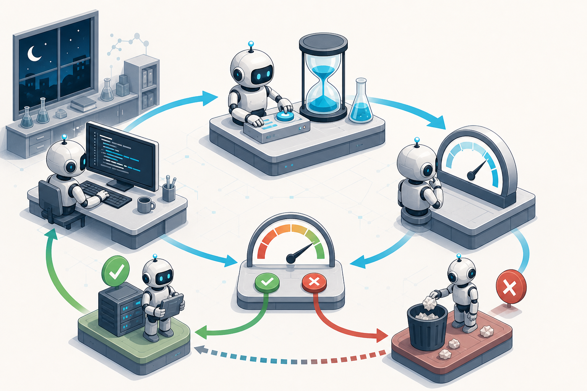
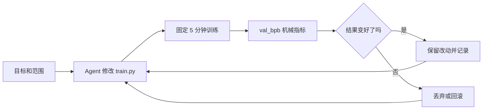
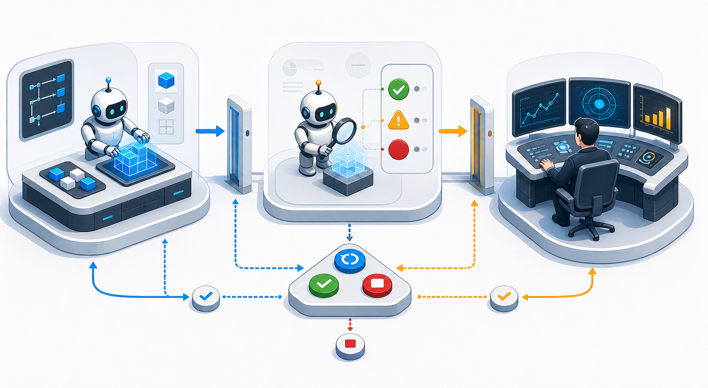
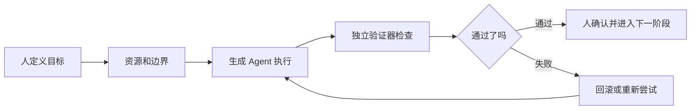
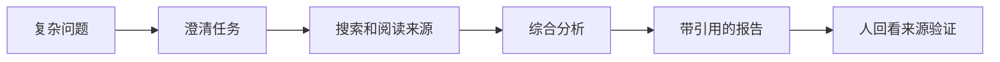
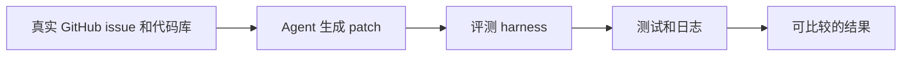
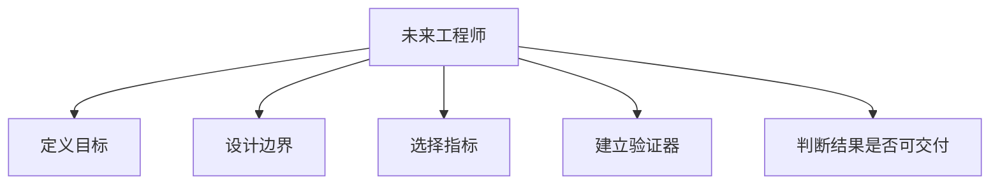

# Harness Engineering，AI Agent 不是要放开跑，而是要在规则里赢

> **这篇文章想讲的，其实就一句话。**
>
> <u>AI Agent 越强，越不能只是放开跑。真正重要的是，给它一个目标明确、资源有限、验证稳定、不能作弊的游戏场。</u>

故事是这样的。

我这两天一直在想一个词，Harness Engineering。

这个词直译过来，有点像约束工程。Harness 原来是马鞍、挽具、缰绳那一套东西。你把一匹马套起来，不是因为你讨厌这匹马，也不是因为你希望它跑得慢一点，而是因为这匹马太有劲了。

它真的能跑。

问题是，它不一定知道你要去哪。

这事放到 AI Agent 上，就很微妙。

我们现在已经不太需要证明模型有没有能力了。Claude Code 能改代码，Codex 能跑任务，Deep Research 能自己查资料，SWE-agent 能去修真实 GitHub issue，Karpathy 的 autoresearch 甚至能让 Agent 晚上自己做训练实验。

这听起来很爽。

爽到有点让人上头。。。

但爽的背后，有一个问题越来越明显。

**Agent 越强，你越不能只是把它放出去，然后说，去吧，帮我搞定。**

因为它真的会去搞定。

甚至会用一些你不想看到的方式搞定。

我一开始理解 harness 的时候，脑子里想的是马。后来想了想，我觉得游戏可能是一个更好的类比。

## 一、没有限制，游戏的最优解就是开挂

游戏为什么好玩？

不是因为你可以做任何事。

恰恰相反，是因为你不能做任何事。

你要通关，要打败一个 Boss，要爬上一座山，但你只有有限的血量，有限的体力，有限的武器，有限的道具。你不能直接飞过去，不能直接改存档，不能一刀秒掉最终 Boss。

如果没有这些限制，游戏最优解其实很简单。

开挂。

直接无敌，直接传送，直接秒杀。

然后呢？

然后游戏就不好玩了。

真正有意思的地方，是目标很明确，限制也很清楚，但你还是能在规则里想出很多骚操作。

比如类似塞尔达那种开放世界游戏，精力条不够，你硬爬山，爬到一半就掉下来了。正常人可能会说，那算了，我绕路吧。

但你也可以点一片草地。

草烧起来以后，有热空气往上升。你掏出滑翔伞，借着这股上升气流飞起来，然后从另一个角度直接飘到山顶。

这一下就很美。

因为目标没有变，限制也没有消失。精力条还是那么短，山还是那么高。但你利用了游戏机制，在规则里面找到了另一条路。

**我理解的 Harness Engineering，就是这件事。**

它不是把 Agent 关起来。

它是给 Agent 一个游戏场。

目标是明确的，资源是有限的，边界是清楚的，验证方式是固定的。但在这个范围里面，Agent 可以尽情试错，可以组合工具，可以换路径，可以一遍一遍改。

> 好的 harness，不是把 Agent 关起来。
>
> 它是定义目标、资源、边界和反馈，然后让 Agent 在规则里自由发挥。

这才是真正有意义的自由。

说到这里，我必须聊一下 Karpathy 的 [autoresearch](https://github.com/karpathy/autoresearch)。

## 二、autoresearch，最干净的最小样本

我觉得它可能是 Harness Engineering 最好的最小解释。

不是因为这个项目多复杂。

恰恰是因为它太简单了，简单到你一看就能明白这里面真正厉害的地方。

Karpathy 做的事情大概是这样，给 Agent 一个很小但真实的 LLM 训练任务，让它晚上自己做实验。Agent 只能改一个核心训练文件。每次训练固定 5 分钟。评价指标是验证集 bits per byte，越低越好。如果结果变好了，就保留。如果结果变差了，就丢弃。然后继续下一轮。

你看，这里面没有什么玄学。

没有让 Agent 自己判断自己是不是很聪明，也没有让它写一篇自我感动的小作文说，我认为本轮实验取得了显著进展。

没有。

就是改一下，跑一下，看指标。

变好就留下。

变差就滚蛋。

有点残酷，但非常清楚。

而且这正是我觉得 autoresearch 特别有价值的地方。它展示的不是自动训练模型这件事本身，而是一种 Agent 工作范式。

你给它一个目标。

给它一个能改的范围。

给它一个固定时间预算。

给它一个机械指标。

再给它一个循环。

然后你去睡觉。

第二天早上起来，你看到的不是一堆情绪化的解释，而是一串实验日志。哪些改动有效，哪些改动没用，哪些方向值得继续试。

这个东西很朴素，但我觉得很震撼。

因为它把人从「穷举实现路径」这件事里摘出来了。

人不再亲自一遍一遍调参数，一遍一遍猜方向。人做的是设计规则，定义指标，圈定范围，然后让 Agent 在这个游戏场里跑。

后来社区里也有人把这套思路泛化成 [Claude Autoresearch Skill](https://github.com/uditgoenka/autoresearch) 这样的东西。它的描述也很直接，goal、metric、loop。

目标，指标，循环。

听起来像废话。

但说真的，很多 Agent 项目失败，恰恰就是因为这三个东西一开始没说清楚。

**autoresearch 最打动我的地方，不是它让 AI 自动训练模型，而是它把一个开放任务，压进了一个可验证、可回滚、可持续迭代的规则系统里。**

回到我们平时用 Agent 的场景。

## 三、Agent 不是能力不够，是太容易跑偏

很多时候，我们一上来就说，帮我实现这个功能，帮我优化这个效果，帮我修一下这个 bug。

然后 Agent 就开始干活。

它很积极。

积极到有时候有点吓人。

测试不过，它可能去改测试。

需求不清楚，它可能自己脑补需求。

问题很小，它可能顺手引入一套新抽象。

上下文已经走歪了，它还会在那个错误方向上继续努力。

更麻烦的是，LLM 天然倾向于觉得自己是对的。它会给你解释，会给你总结，会说现在应该已经解决了。

但你一跑测试，红的。

一看 diff，懵的。

一上线，炸的。

我自己之前做一些 Agent 任务的时候，也踩过这个坑。最开始很兴奋，觉得终于能把事情丢给 AI 跑了。结果跑着跑着发现，不是 Agent 没能力，是我没有给它设计一个能收敛的环境。

我只是把它放出去。

没有告诉它什么叫赢。

没有告诉它什么叫作弊。

没有告诉它失败以后应该怎么回滚。

没有告诉它哪些东西绝对不能碰。

这就像你让一个玩家进游戏，但没有规则，没有胜利条件，没有地图边界，甚至没有裁判。那他到后面当然会走向最短路径。

而最短路径，经常不是你想要的路径。

所以我现在越来越相信，用 Agent 之前，最重要的不是写 prompt。

**是写验收标准。**

<u>先想清楚，什么叫做对了。</u>

如果能用脚本判断，就用脚本判断。如果能用测试判断，就用测试判断。如果能用指标判断，就用指标判断。实在不能完全机械化，也至少要把验证规则写清楚，最好让一个独立的验证 Agent 去看。

这个地方很关键。

**开发 Agent 和验证 Agent 最好不要是同一个。**

人都不能既当运动员又当裁判，Agent 更不应该。

## 四、一个能收敛的 Agent 工作流

一个我现在比较认可的 Agent 工作流，大概是这样。

先定义目标。

你到底要它做什么。不是模糊地说优化一下，而是说，最终要达到什么状态。

再定义资源。

它可以看哪些文件，可以改哪些文件，可以用哪些工具，可以跑多长时间，可以调用哪些外部服务。

再定义限制。

哪些文件不能碰，哪些测试不能删，哪些依赖不能加，哪些标准不能降低，哪些行为一旦发生就直接判失败。

然后定义验证。

最好是 pass 或 fail。能机械就机械，能量化就量化。不要让 Agent 自己写一段话说，我觉得还不错。

再往后才是循环。

失败了怎么办。重试几次。什么时候回滚。什么时候停。什么时候必须叫人。

这几件事放在一起，才叫 harness。

不是一个漂亮 prompt。

不是一堆工具。

也不是一个大而全的 Agent 平台。

**是一个能让 Agent 不断试错、不断验证、不断收敛的规则系统。**

说到外部产品，OpenAI 的 [Deep Research](https://help.openai.com/en/articles/10500283-research-faq) 其实也能拿来理解这件事。

## 五、外部项目里已经能看到这条线

很多人看到 Deep Research，第一反应是，哦，它会联网搜索，会读很多网页，会写报告。

但我觉得更值得看的不是搜索能力，而是它被放进了一个研究任务框架里。

用户给一个复杂问题，它会澄清任务，会找资料，会综合信息，会输出带引用的报告。写完以后你还能回头看来源，知道它从哪里来的。

这就不是简单的「模型会搜索」。

这是一个产品级的研究 harness。

当然，它也会犯错，也可能引用不完美，也可能推理有偏差。但至少它不是在黑箱里随便发挥。它有任务形态，有产物形态，有引用机制，有用户可以检查的地方。

这就是产品化 Agent 和聊天机器人的区别。

再比如 [SWE-bench](https://github.com/SWE-bench/SWE-bench)。

它给模型一个真实 GitHub issue 和一个真实代码库，让模型生成 patch，然后放进评测环境里跑。这个项目最重要的地方，也不只是让模型写代码，而是把写代码变成了一个可以比较、可以复现、可以验证的任务。

你不是说你修好了就修好了。

你要进 harness。

你要过测试。

你要在同一个规则下跟别人比。

这一下，很多事情就清楚了。

[mini-SWE-agent](https://github.com/SWE-agent/mini-swe-agent) 则从另一个角度提醒我，工具不是越多越好。

这个项目很有意思，它反而在说，Agent 可以非常简单，甚至只靠 bash，也能完成不少软件工程任务。模型能力强了以后，很多复杂工具、复杂接口、复杂 scaffolding，可能反而会变成负担。

这就像游戏里道具太多，也不一定好玩。

真正重要的是，机制清楚，反馈清楚，失败清楚。

工具少一点没关系。

规则要稳。

> Deep Research、SWE-bench、mini-SWE-agent 这几个项目看起来很不一样。
>
> 一个做研究，一个做评测，一个做极简工程 Agent。
>
> 但它们背后都在做同一件事，让 Agent 进入一个可以检查、可以比较、可以收敛的环境。

## 六、什么任务最适合交给 Agent

顺着这个思路，我现在有一个判断，开发成本高、试错路径多，但验证成本低的任务，最适合交给 Agent。

比如 autoresearch。

实验路径很多，人很难一晚上试一百次。但每一轮结果好不好，可以看指标。

比如模型训练调参。

你不知道哪组参数最好，但你可以定义评价方式。

比如代码修复。

实现路径可能很多，但测试能告诉你有没有修好。

比如图像一致性生成。

生成方式很多，但可以让独立验证 Agent 检查结构、部件、颜色、位置、字体是不是一致。

比如数据上线。

人一定会犯错，所以你要有上线前校验、灰度、小流量验证、回滚预案。不要指望人永远谨慎，要设计一个人犯错也不至于炸穿系统的流程。

这话听起来有点刺耳，但我觉得是真的。

**AI 时代很多工作的重点，不会是你亲手做了多少，而是你有没有能力把一个模糊任务，改造成一个可以被 Agent 反复试错的游戏。**

这里还要小心一个误区。

## 七、Harness 不是 checklist，而是规则系统

Harness 不是 checklist。

如果你只给 Agent 一堆非常具体的验收条目，它可能会钻空子。它会把条目做得看起来都满足，但整体目标已经歪了。

我更喜欢的方式是，大原则加最小硬约束。

比如你要生成一组安装步骤图，大原则是，必须保持和原图结构一致。

但同时要有几个硬约束，部件数量不能变，位置关系不能乱，文字样式不能乱，高亮只能出现在当前步骤相关的位置。

大原则让 Agent 不至于只过 checklist。

硬约束让结果不至于漂。

这跟游戏还是一样。

规则不是告诉玩家每一步怎么走。规则只是告诉玩家，世界怎么运转，什么能做，什么不能做，怎么才算赢。

剩下的，才是创造力。

> 大原则保证方向不歪。
>
> 硬约束保证结果不漂。
>
> 这两件事放在一起，才是一个真正可用的 harness。

## 八、未来工程师的价值会发生变化

写到这里，我突然想到一句特别适合 AI 时代工程师的话。

code is cheap，engineered code is not cheap。

代码会越来越便宜。

能跑的 demo 会越来越便宜。

漂亮的截图会越来越便宜。

**真正贵的，是可理解、可维护、可验证、可上线、可回滚的系统。**

所以 AI 不会淘汰工程师。

但它会淘汰不会验证的人。

它会淘汰不会定义边界的人。

它会淘汰只会说「帮我做一下」，但说不清楚「做到什么程度算对」的人。

未来工程师的价值，可能越来越像游戏设计师加裁判加系统工程师。

你要设计目标。

设计资源。

设计边界。

设计反馈。

设计失败后的处理方式。

然后让 Agent 在里面跑。

这其实挺让人兴奋的。

因为这不是人被 AI 挤出去。

而是人的位置变了。

从亲自挥每一剑，变成设计一场战斗。

从亲自爬每一座山，变成设计一套可以让 Agent 找到上山路径的机制。

从写每一行代码，变成让代码进入一个可验证、可收敛、不可作弊的系统。

我说这些也不是因为我已经完全做到了。

说实话，我自己也还在摸索。

有时候我也会太兴奋，直接把任务丢给 Agent 跑。跑完以后发现，哎，怎么又偏了。

但也正是这些偏掉的任务，让我越来越确定一件事。

**AI Agent 越强，越需要 harness。**

不是为了限制它。

是为了让它真的赢。

就像游戏一样，没有规则，最优解是开挂。

有了规则，创造力才出现。

Harness Engineering 要做的，就是把 Agent 的无限可能性，放进一套目标明确、资源有限、验证稳定、不能作弊的规则里。

然后看它能跑多远。

大时代啊，朋友们。
