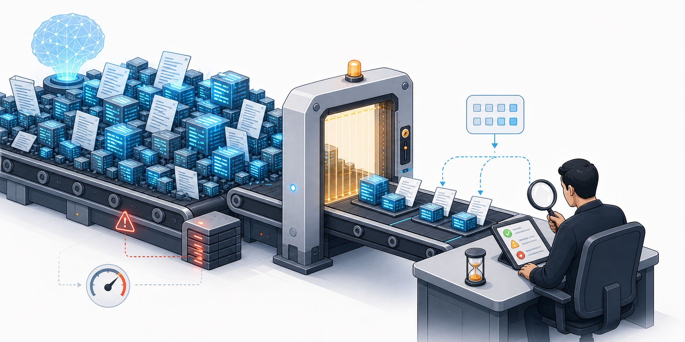
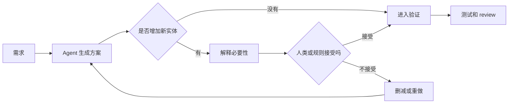
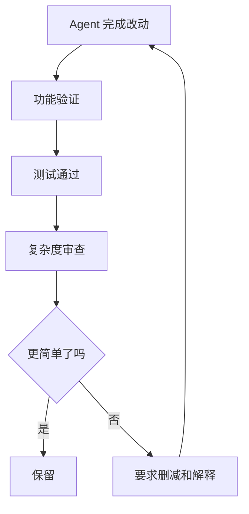

# AI Agent 越能写，我们越需要奥卡姆剃刀

最近用 Agent 写代码和文档时，我越来越频繁地遇到一个反直觉的问题。

不是它写得不够多，而是它太容易写太多。你给它一个需求，它可以很快改出一组文件；你让它补文档，它可以顺手生成几千字；你让它整理架构，它会把流程、原则、README、设计说明、测试说明和部署说明一起补齐。表面上看，这是一种很直接的生产力提升。

但这些产出最后不是给空气看的。

代码要有人 review，文档要有人阅读，系统要有人维护。更现实一点说，出了问题以后，也要有人负责。Agent 可以快速生成内容，但人类并不会因此获得同等速度的理解能力。

所以我现在越来越觉得，AI Agent 写得越快，我们越需要奥卡姆剃刀。

> <u>AI Agent 时代，真正危险的不是代码写不出来，而是代码和文档写得太快、太多，最后超过了人类能理解、能 review、能负责的范围。</u>

## 一、AI 时代的复杂度，不再是慢慢长出来的

以前人写代码，当然也会制造技术债。需求赶、抽象乱、命名糊、注释过期、模块边界一点点腐烂，这些都是老问题。

但过去有一个天然限制，人的速度。

一个人一天能写多少代码，是有限的。一个团队一个 sprint 能塞进去多少复杂度，也是有限的。再怎么堆出屎山，它也是一砖一瓦堆出来的。这个事实听起来有点奇怪，但它很重要，因为人类产出的复杂度通常也留下了人类理解过的痕迹。

人写出来的屎山，虽然难维护，但你通常还能找到一个人问，当时为什么这么写，这个判断条件是谁加的，这个配置为什么不能删，这个接口为什么绕了一圈。答案可能很离谱，对方也可能已经离职，但至少它曾经被某个人理解过。

AI 写出来的复杂代码，问题不完全一样。它可能从一开始就没有被任何人完整理解过。

这才是让我觉得危险的地方。不是因为 AI 写的代码一定差，而是因为它写得太快、太多、太像那么回事。一个原本很小的问题，可能被它扩成一个看起来很完整的小系统。等你回过头 review 的时候，已经不是看一眼 diff 的问题，而是要重新理解一个小型世界。

## 二、代码不是越多越工程化，文档也不是越多越清楚

这里要先说清楚，我不是反对 AI 写代码，也不是反对 AI 写文档。相反，我觉得 AI 很适合补很多以前没人愿意补的东西，比如测试、注释、迁移脚本、边界情况和接口说明。

这些东西以前经常没人写，不是因为不重要，而是因为人懒、赶时间、嫌麻烦。AI 能把这些缺口补起来，当然是好事。

但补东西和堆东西不是一回事。

文档最后是给人看的。如果是给 Agent 自己看的内部记忆，那可以另说。但如果一份文档要帮助新人理解项目、帮助维护者定位问题、帮助 reviewer 理解这次改动，那它就不是越多越好。

代码也是一样。代码最后不只是机器执行，它还要被人读。[PEP 8](https://peps.python.org/pep-0008/) 里有一句很经典的话，大意是，代码被阅读的次数，远远多于它被编写的次数。这个判断放到 AI 时代，反而更重要了。

因为写代码的成本正在快速下降，但读代码的成本没有同步下降。你让 Agent 一分钟写完 500 行代码，人类 reviewer 并不会因此拥有一分钟读完 500 行代码的能力。

问题就在这里。

写的速度变快了，理解的速度没有变快，责任的速度更没有变快。

## 三、奥卡姆剃刀不是哲学装饰，是工程救命绳

[奥卡姆剃刀](https://www.britannica.com/topic/Occams-razor) 经常被概括成一句话，如无必要，勿增实体。

这个说法很老，听起来像哲学课上的东西。但在 AI Agent 时代，它突然变得非常具体。因为 Agent 天然容易增实体。

它会加新文件、新抽象、新工具函数、新配置、新文档，也会加一整套看起来很有工程感的流程。有时候你只是让它修一个按钮，它能顺手给你重构半个状态管理；你只是让它补一个接口说明，它能写出一份小型白皮书；你只是让它解决一个测试失败，它可能为了让测试通过，绕开原来的设计，开出一条新的分支逻辑。

这些东西不一定错，但每多一个实体，都不是免费的。

多一个文件，就多一个未来要理解的地方。多一个抽象，就多一个未来要解释的概念。多一段文档，就多一个未来可能过期的承诺。多一条分支逻辑，就多一种未来可能出问题的路径。

所以奥卡姆剃刀不是让我们变保守，而是在提醒我们，每一次增加复杂度，都应该先付一次思想税。

你真的需要它吗？不加行不行？删掉会不会更清楚？用现有结构能不能解决？这个东西未来谁来维护？

## 四、Claude Code 放弃 RAG，是一个很好的反例

有个例子我觉得特别适合放在这里。

在 [Latent Space 对 Claude Code 团队的访谈](https://www.latent.space/p/claude-code)里，Boris Cherny 讲过一件事。Claude Code 很早期的版本，其实试过给代码库做 RAG。大概方式就是先把 codebase index 起来，用类似 Voyage 这样的 embedding/retrieval 方案，把看起来相关的代码片段召回给模型。

这条路听起来非常合理。Agent 要理解代码库，当然要给它一个知识库；上下文有限，那就用 RAG 帮它把相关内容找出来。如果它还需要读本地文档、读官方文档、联网搜索，那就先把这些内容塞进一个向量库里，后面再按相似度召回。

这套思路在直觉上太顺了。

很多人做 Agent 系统时也会天然这么想，一上来先加向量库、加记忆、加检索层、加各种看起来更聪明的工具。好像只要工具越多，上下文越长，skill 越丰富，Agent 就会越强。

但 Claude Code 团队后来发现，真正效果更好的，反而是更朴素的 agentic search。也就是让模型自己用 glob、grep 这类普通代码搜索工具，在真实代码库里一轮一轮找它需要的东西。Boris 给出的原因很直接，第一是效果更好；第二是 RAG 有索引成本，代码一变，索引就可能漂移；第三是安全和责任问题，索引总要放在某个地方，敏感代码库并不一定适合被额外上传或复制一份。Claude Code 的 [官方 FAQ](https://support.claude.com/en/articles/14554922-claude-code-user-faq) 后来也把这个取向写得很明确，源码在本地，只有当前任务需要的部分会被发给 API，不会把整个 repo 整体索引上传。

我觉得这个例子非常有意思，因为它刚好打破了我们对 AI 系统的一个直觉。

我们很容易以为，模型越强，外面的工具就应该越厚。上下文越长越好，RAG 越完整越好，skill 越多越好，MCP 越多越好，最好把所有东西都提前准备好，喂到 Agent 面前。

但有时候，模型变强以后，最好的 harness 反而是更薄的 harness。

因为强模型已经不只是一个被动等你投喂上下文的东西了。它可以自己去遍历本地文件，可以自己打开文档，可以自己搜索，可以一轮一轮缩小范围，还可以熟练使用 grep 这种朴素得不能再朴素的工具。

这时候，RAG 反而可能变成一层损耗。

RAG 不是没价值。对于很多知识库问答、客服、企业文档场景，它仍然是很重要的工程方案。但在代码搜索这种场景里，问题经常不是「找到语义上相似的内容」，而是「找到准确的符号、错误信息、配置键、调用点、测试文件」。相似不等于准确。一个向量召回出来的片段可能看起来很相关，但缺了真正关键的那一行；而一次 grep 可能直接把那行代码摆到模型面前。

这点放到本地文档和联网资料里也一样。很多时候我们真正需要的不是一段「看起来相关」的材料，而是那份文档里某个具体标题下面的原文，是某个 API 参数的准确定义，是某个错误信息对应的那一段说明。RAG 擅长把相似的东西捞出来，但它不天然保证捞出来的就是完整、准确、当前这一步最需要的东西。

而一个会搜索、会定位、会反复验证的 Agent，反而可以用更少的上下文拿到更准的内容。

更关键的是，RAG 本身也是一个实体。

它要构建索引，要更新索引，要处理权限，要处理漂移，要处理召回噪声，要处理 chunk 策略，还要处理召回结果怎么塞进上下文。它看起来是在帮 Agent，但如果模型已经有能力自己搜索、自己判断、自己缩小范围，那么这一层就可能从「能力增强」变成「能力遮挡」。

这就是奥卡姆剃刀在 Agent 工程里的具体含义。

不是说永远不要 RAG，也不是说 grep 永远比向量检索好。而是说，**每一个工具、每一层记忆、每一个检索系统，都必须证明自己的必要性。** 如果一个更简单的工具已经能让模型稳定完成任务，那么复杂工具带来的成本、噪声和约束，就不能被当成免费的增强。

Claude Code 这个选择，其实是在告诉我们，好的 harness 不一定是把模型包得越来越厚，而是把最少、最准、最贴近真实环境的工具交给模型。

## 五、技术债在 Agent 手里，会变成高利贷

软件工程里有个概念，叫技术债。[Martin Fowler](https://martinfowler.com/bliki/TechnicalDebt.html) 写过很多关于 technical debt 的文章，他讲得很清楚，技术债不是简单的代码写烂了。它更像一种借款，你现在为了更快交付，接受了一些未来需要偿还的成本。

这个比喻放到 Agent 上，尤其贴切。

人写代码的时候，技术债增长是有速度上限的，因为人慢。Agent 不一样，它可以一天跑很多轮，可以一次改很多文件，可以不断补文档、补实现、补抽象、补兼容层。看起来像是生产力暴涨，但如果没有 review、约束、验证和删减，这些产出可能不是资产，而是债。

而且是高利贷。

今天你为了省时间，让 Agent 快速写了一堆自己没完全看懂的代码。明天它在这堆代码上继续加逻辑。后天另一个 Agent 又基于这些逻辑继续扩展。再过几天，系统看起来还在跑，但已经没人能说清楚它为什么能跑。

这就像一个人收入不高，但想买的东西很多，于是开始借钱。刚开始很爽，想要的东西马上到手了。但债不是不用还，只是延后了，而且利息一直在长。

AI 生成的技术债也是这样。你不是不需要理解它，只是把理解这件事推迟了。推迟到未来某个更糟糕的时候，比如线上出问题的时候，比如新人接手的时候，比如要重构的时候，比如客户催你修 bug 的时候。

那时候你才发现，当初省下来的时间，会以更痛苦的方式回来。

## 六、Harness 的作用，不是限制能力，是限制债务

说到这里，Harness Engineering 就又回来了。

很多人一听约束 Agent，第一反应可能是，这是不是在限制 AI 的能力。我现在反而觉得，恰恰相反。Harness 不是为了让 Agent 少做事，而是为了让 Agent 做出来的东西还能被人类接住。

这里的接住包括很多层，能 review，能解释，能测试，能维护，能回滚，也能让后来的人继续在上面工作。

如果一个 Agent 写出来的东西只有它自己能看懂，那不叫工程产出。哪怕它暂时能跑，也很危险。

所以 Harness 里必须有一层专门处理复杂度。不能只问功能做完了吗，还要问改动是不是最小的，有没有不必要的新文件，有没有不必要的新抽象，有没有不必要的新依赖，有没有不必要的新文档，有没有用一堆复杂逻辑掩盖一个简单问题。

这就是把奥卡姆剃刀放进 harness。

不是让 Agent 每次都少写，而是让 Agent 每次都证明，为什么必须多写。

## 七、复杂项目里，最重要的是人还能不能理解

小项目里，AI 多写一点，问题可能没那么大。一次性脚本、临时 demo、实验性页面，这些东西坏了就坏了，删了重来也可以。

但复杂项目不一样。生产级项目不一样。多人维护的项目更不一样。

这里面最重要的不是 AI 能不能生成代码，而是人还能不能理解系统。如果一个复杂项目最后变成只有 Agent 能看懂，只有 Agent 能改，只有 Agent 能解释，那其实已经很危险。

因为公司不会让 Agent 背锅。线上事故不会找 Agent 开复盘会。客户也不会接受一句，这是 AI 当时生成的，我也不知道为什么。

最后负责的人，还是人。

所以人必须始终留在理解链条里。这也是为什么我觉得代码 review 在 AI 时代不会消失，反而会更重要。

只不过 review 的重点会变。以前 review 可能更多是看逻辑有没有 bug，风格是不是统一，边界有没有考虑。现在还要多看一层，这段代码有没有必要存在，这个抽象有没有必要存在，这份文档有没有必要存在，这次改动有没有把未来的维护成本推高。

## 八、怎么把奥卡姆剃刀写进 Agent 工作流

我现在比较想把它变成几个具体规则。

第一，默认要求最小 diff。Agent 每次改动前，都应该优先尝试最小修改。不是不能重构，而是重构要有明确理由。

第二，新增文件需要说明必要性。不是随手新增 helper、service、manager、utils。每多一个文件，都要解释为什么旧结构放不下。

第三，新增依赖默认不允许，除非收益明显大于长期维护成本。很多时候 Agent 喜欢引依赖，是因为它觉得这样最快。但最快不等于最适合。

第四，文档只写人需要读的部分。不是每个函数都要写一段散文。好的文档应该解释上下文、边界、决策原因，而不是把代码翻译成中文。

第五，新增工具和长期上下文也要证明必要性。不要因为可以接 MCP，就把所有 MCP 都接上；不要因为可以写 skill，就把每个偏好都写成 skill；不要因为上下文窗口变长，就把所有历史都塞进去。上下文本身也是成本，工具本身也是成本。

第六，每轮结束要做复杂度审查。不是只看测试绿不绿，还要看改动是否变简单了。如果功能完成了，但系统复杂度大幅上升，那这一轮不应该轻易通过。

这里面最关键的不是某一条规则，而是姿态。

不要默认相信更多就是更好。在 AI Agent 时代，更多经常只是更快地产生维护成本。

## 九、未来的工程能力，是会删东西

写到这里，我突然觉得，AI 时代最稀缺的工程能力，可能不是写更多代码，而是删代码。

删不必要的抽象，删过期的文档，删重复的逻辑，删为了兼容一个不存在场景而写出的分支，删掉那些看起来很工程化、但其实只是在制造负担的东西。

以前我们说，一个成熟工程师和初级工程师的区别，不是能不能写复杂代码，而是能不能把复杂问题写简单。

AI 时代这句话会更狠。因为复杂代码太容易生成了，复杂文档太容易生成了，复杂系统太容易看起来像那么回事了。

真正难的是，面对一堆看起来很完整的 AI 产物，你敢不敢说，不需要。

敢不敢删。

敢不敢把它压回一个人类能理解的形状。

## 十、结尾

我说这些，不是因为自己已经做得很好。说实话，我也经常被 Agent 的产出速度带着跑。它一口气改完很多东西的时候，我会兴奋；它把文档补得满满当当的时候，我也会觉得，这下完整了。

但兴奋完以后，还是要回到一个很朴素的问题。

这些东西，未来谁来读？谁来 review？谁来维护？谁来为它负责？

如果答案还是人，那我们就不能只追求 Agent 写得多、写得快、写得完整。我们要让它写得刚刚好。

奥卡姆剃刀不是反 AI，Harness 也不是反 AI。它们都是为了让 AI 的能力，最后还能落到人类可理解、可维护、可负责的工程世界里。

AI Agent 越能写，我们越要学会删。
