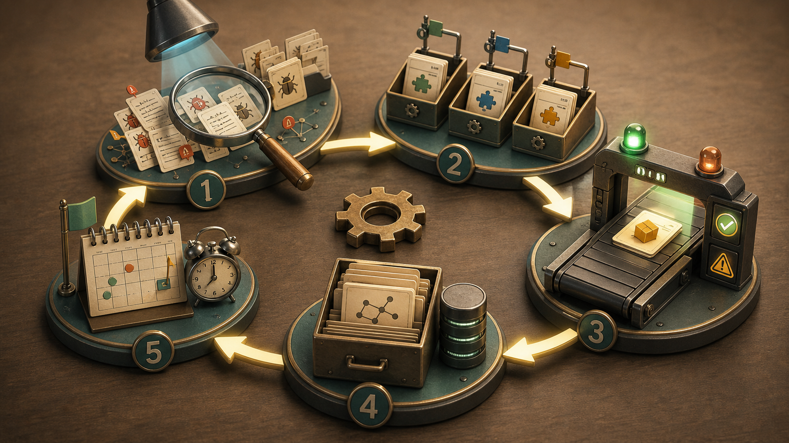
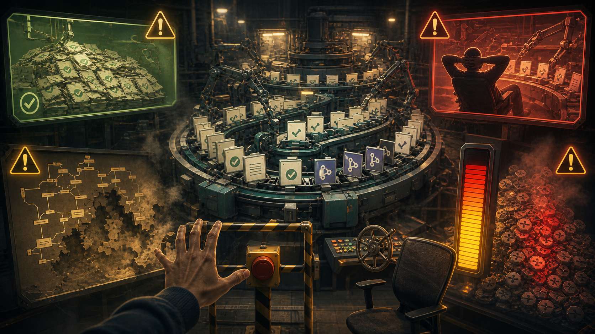

# Loop Engineering 详细总结：让 Agent 自己转起来的工程方法

> 来源：`/Users/mactawish/Desktop/Loop-Engineering-IEEE.pdf`
> 这篇文档是对 PDF 的结构化总结，重点整理 Loop Engineering 的概念、产生背景、工程结构、风险和落地方法。

## 一句话理解

Loop Engineering 是继 Prompt Engineering、Context Engineering、Harness Engineering 之后，围绕 Agent 工作流出现的下一层工程方法。

它的核心变化可以概括成一句话：

> 人的角色从一次次提示 Agent，转向设计一个会持续提示 Agent、调度 Agent、检查 Agent、保存状态并再次启动的系统。

如果说 Prompt Engineering 关注「这一次该怎么说」，Context Engineering 关注「这一次该给模型看什么」，Harness Engineering 关注「这一次运行要给 Agent 配哪些工具、权限和完成标准」，Loop Engineering 关注的就是「如何让这一套运行自己周期性地转起来」。

所以 Loop Engineering 的关注点，已经从写出一个更好的 prompt、在一次 Agent 运行里配置更多工具，推进到把一次 Agent 运行变成一个可重复、可调度、可验证、可积累状态的循环系统。

## 为什么这个概念现在才被命名

PDF 里一个很重要的判断是，Loop Engineering 的实践早于概念本身。

很多团队和个人很早就已经在写某种「循环」，比如定时检查 CI、自动扫描 issue、让 Agent 修复问题、再让另一个 Agent 做 review。但这些实践在很长时间里只是散落在工具链和个人脚本里，没有被统一命名。

最近它被明确提出，主要有三个条件逐渐成熟：

1. Agent 已经能稳定完成一些非平凡任务。
   过去让 Agent 自己跑一轮都不够可靠，更难谈长期循环。现在 coding agent 能读项目、改代码、运行命令、修复问题，至少具备了让它独立处理一个小任务的基础。

2. 主流 harness 开始出现调度能力。
   例如定时运行、自动化任务、后台 agent、worktree、skills、sub-agent、connector 等能力逐渐进入工具链，循环不再只能靠临时脚本拼出来。

3. Token 成本下降，让重复运行变得现实。
   如果每次 Agent run 都非常昂贵，循环运行会显得浪费。随着成本降低，反复调度 Agent、让它周期性检查和处理任务，才有了更成熟的土壤。

这也解释了为什么 Loop Engineering 的名字来得比实践晚。很多工程范式都是这样，先有人在现场反复用，等到实践足够普遍、工具足够成熟、成本足够低，概念才会浮出水面。

## 从 Prompt 到 Context 到 Harness 再到 Loop

PDF 把 Agent 工程能力分成四层，每一层关注的对象都比下面一层更大。

| 层级 | 关注对象 | 核心问题 |
| --- | --- | --- |
| Prompt Engineering | 一次表达 | 我应该怎样告诉模型 |
| Context Engineering | 一次上下文窗口 | 现在应该放入、检索、压缩或清理哪些上下文 |
| Harness Engineering | 一次 Agent 运行 | Agent 可以用哪些工具、执行哪些动作、怎样算完成 |
| Loop Engineering | 多次运行构成的循环 | 如何让 Agent 周期性地自己运行、接续状态、持续处理任务 |

Harness Engineering 已经把 Agent 从单纯聊天推进到「能做事」的阶段。它给 Agent 配工具、权限、动作边界、失败恢复和完成条件。

Loop Engineering 再往上走一层。它不只关心这一次运行是否武装充分，还关心下一次运行怎么被触发，上一次运行留下的状态怎么被读取，多名 Agent 怎么并行工作，谁负责检查结果，未完成任务如何进入下一轮。

这层变化非常关键。因为在 Prompt、Context、Harness 层面，错误通常发生在一次交互或一次运行里，人比较容易发现。但到了 Loop 层面，错误会被写进状态文件，被下一轮读取，再被后面的运行继续放大。一个错误假设如果存活了很多轮，就会逐渐变成系统里的承重结构。

所以 PDF 里反复强调，Loop Engineering 最难的部分，往往会从让 Agent 跑起来，转移到让循环内部存在一个真正能说「不」的检查机制。

## 一个 Loop 的五个动作

PDF 把一个循环的一轮拆成五个动作：Discovery、Handoff、Verification、Persistence、Scheduling。

| 动作 | 含义 | 典型实现 |
| --- | --- | --- |
| Discovery | 自动发现本轮该做什么 | 读取 CI、issue、commit、inbox、监控告警 |
| Handoff | 把任务交给执行 Agent | 为每个任务开独立 worktree 或任务上下文 |
| Verification | 用独立检查者验证结果 | 第二个 Agent、测试、lint、Playwright、人工 checkpoint |
| Persistence | 保存状态到上下文之外 | PR、ticket、markdown state file、Linear board、inbox |
| Scheduling | 让下一轮自动发生 | 定时器、事件触发、cloud routine、GitHub Actions |

这五个动作里，Discovery 决定循环能不能找到有价值的问题；Handoff 决定并行执行会不会互相踩踏；Verification 决定循环是否有能力拒绝错误结果；Persistence 决定循环有没有跨轮记忆；Scheduling 决定它是否真的会自己转起来。

缺任何一个动作，循环都会变形。

如果没有 Discovery，人每天还要手动告诉它该做什么。
如果没有 Handoff，多名 Agent 会改同一份工作目录，冲突很快失控。
如果没有 Verification，循环会变成 Agent 给自己点头。
如果没有 Persistence，每一轮都会忘记上一轮做过什么。
如果没有 Scheduling，它只是一个需要人记得运行的脚本。

## 一个 Loop 需要六个部件

五个动作描述的是一轮循环里发生了什么；六个部件描述的是循环需要哪些工程构件。

| 部件 | 作用 | 对应动作 |
| --- | --- | --- |
| Automations | 按时间或事件触发运行 | Scheduling |
| Worktrees | 给并行 Agent 独立工作目录 | Handoff |
| Skills | 把项目知识固化成可复用规则 | Discovery |
| Connectors | 连接外部系统，例如 issue、数据库、Slack、API | Discovery / Persistence |
| Sub-agents | 区分执行者和检查者 | Verification |
| Memory | 把状态保存到磁盘或外部系统 | Persistence |

其中 Skills 和 Memory 的区分很重要。

Skill 是项目知识的长期固化，比如项目规则、目录结构、常见陷阱、代码风格、处理流程。它解决的是每次都要重新解释项目背景的成本。

Memory 是循环运行中的状态保存，比如今天发现了哪些问题、哪些已经处理、哪些进入 PR、哪些需要人工处理。它解决的是跨轮接续的问题。

上下文窗口会被清空，Agent 会忘记；写到文件、issue、board 或 PR 里的状态不会忘记。

## Generator / Evaluator 分离是核心

PDF 花了很大篇幅讲一个关键点：写代码的 Agent 不适合给自己的结果打分。

原因包含模型能力，也包含结构问题。一个 Agent 在生成代码时，已经在上下文里积累了很多「为什么这样写」的理由。当它再回头评价自己的结果时，很容易看到自己的推理链条，却忽略最终行为是否真的正确。

这就是所谓的「自己批改自己的作业」。

更可靠的做法是把 Generator 和 Evaluator 分开：

| 角色 | 任务 |
| --- | --- |
| Generator | 负责生成方案、修改代码、提交结果 |
| Evaluator | 默认怀疑结果有问题，负责运行、点击、测试、截图、检查边界条件 |

Evaluator 最好不要只读代码。它应该像 QA 一样行动：运行测试、打开页面、点击按钮、检查 DOM、截图、验证真实行为。

PDF 里提到，前端任务里可以让 evaluator 通过 Playwright MCP 打开页面并真实操作。这样判断依据会从「代码看起来合理」转向「我执行了这个操作，结果确实符合预期」。

这也对应你之前在 Harness Engineering 里提到的一个观点：开发和验证上下文要分开，不能让同一个 Agent 既当选手又当裁判。

## 五种常见失败模式

PDF 把 Loop 的失败模式和五个动作一一对应。

| 失败模式 | 缺失动作 | 表现 | 修复方式 |
| --- | --- | --- | --- |
| Nodding Loop | Verification | Agent 写完后自己宣布通过 | 引入独立 evaluator |
| Amnesiac Loop | Persistence | 每一轮都忘记上一轮进度 | 写 state file 或外部状态 |
| Manual Loop | Scheduling | 人不触发就不运行 | 增加真实定时器或事件触发 |
| Blind Loop | Discovery | 人每天还要决定任务列表 | 把发现逻辑写进 skill |
| Tangled Loop | Handoff | 多个 Agent 改同一目录，冲突混乱 | 每个任务使用独立 worktree |

这些问题经常聚在一起出现。很多团队最容易先做出 Discovery 和 Handoff，因为这两个动作会立刻产生可见输出；安全相关的 Verification、Persistence、Scheduling 反而容易被省掉。

这会导致一个危险局面：循环看起来很勤奋，实际上没人知道它是否正确，也没人能及时阻止它。

## 三个真实案例

PDF 提到三个不同规模的实践案例。

### 1. Addy Osmani 的 Morning Triage Loop

这是一个个人级别的循环。

每天早上自动运行一个 triage skill，读取昨天失败的 CI、仍然打开的 issue、近期 commit，然后写入 markdown 文件或 Linear board。每个值得处理的问题会被分配到独立 worktree，由一个 sub-agent 起草修复，再由另一个 sub-agent 做 review。无法处理的内容进入 inbox，等待人介入。

这个例子的价值在于，它展示了一个小循环的完整形态：自动发现、隔离执行、独立验证、状态保存、下一天继续。

### 2. Stripe 的 Minions Pipeline

Stripe 的 Minions 是企业规模案例。PDF 引用的数字是每周合并超过 1300 个机器生成的 PR。

这个系统的重点已经从 Agent 强弱，转到确定性流程和 LLM 步骤的清晰分工。

在模型开始写代码之前，确定性 orchestrator 会先收集上下文，包括 Slack 触发、Jira、文档、Sourcegraph、MCP 等。能用硬编码规则处理的部分尽量不交给 LLM。Agent 写完代码后，linter、commit、sandbox 等流程由硬编码 gate 控制，Agent 无法绕过。

这说明大规模 Loop 的可靠性主要来自约束质量，单纯模型大小无法保证可靠性。

还有一个细节很重要：这些 PR 仍然有人 review。人没有离开，只是从写代码的位置移动到了审查、判断和把关的位置。

### 3. 本地调度和云端调度

PDF 区分了几种调度方式。

本地 `/loop` 或桌面自动化适合高频、需要访问本机文件或本地服务的任务，但机器关机后循环就停了。

云端调度或 GitHub Actions 适合真正无人值守的任务，比如凌晨扫描 issue、打开 PR、定期检查仓库状态。代价是触发频率可能更低，环境也更像干净 clone。

成熟的循环往往会同时使用两类调度：本地负责紧密反馈，云端负责真正无人值守的周期任务。

## 四种隐性成本

Loop Engineering 最吸引人的地方，也是它最危险的地方：它能让一个人做出一个小团队的输出。

PDF 总结了四种会悄悄累积的成本。

### 1. Verification Debt

循环产生了很多 PR、修复和改动，但没有充分验证。这些未验证内容会变成验证债。测试覆盖不到的行为、需求理解偏差、边界条件遗漏，都会在后面集中爆发。

防线是独立 evaluator，以及真正会执行的验证流程。

### 2. Comprehension Rot

Agent 写得越快，人对代码库的理解越容易落后。代码在增长，人的心智地图没有同步更新。

防线可以设计成每天抽样阅读一部分循环产物，并强迫自己解释：这次改了什么，为什么这样改。解释不出来，就说明心智地图已经开始落后。

### 3. Cognitive Surrender

当循环足够顺滑时，人会逐渐停止判断，只接受它交上来的结果。最危险的情况，是从没时间看滑向不想看。

防线是保持至少一个人工 checkpoint。Loop 可以执行，但最终边界和关键决策不能完全交出去。

### 4. Token Blowout

循环会生成 helper、重试、多轮运行。如果没有上限，一个 bug 可能让系统空转一整夜，最后留下高额账单和一堆无效改动。

防线是提前设置 per-run budget、daily budget、最大重试次数和停止条件。

这四种成本会相互加强。未验证输出越多，人越不了解系统；越不了解系统，越容易放弃判断；越放弃判断，循环越可能无人看管地继续跑；跑得越久，Token 成本和错误积累越大。

## Loop Engineering 的经济学：生成变便宜，判断变稀缺

PDF 最重要的判断之一是：Loop 让生成变得接近免费，但判断变得更稀缺。

代码、计划、修复、PR、迁移、重构，都可以被循环批量生成。过去工程师大量时间花在打字、样板代码、机械重构和重复执行上。Loop 会把这些工作压到很低成本。

工程师的价值因此更集中到判断上：

判断哪个需求值得做。
判断哪个方案是正确方向。
判断哪个输出只是看起来合理。
判断哪里应该停下来让人看。
判断哪些任务适合循环，哪些必须人工掌控。

同一个 Loop 放在不同人手里会产生完全不同的结果。一个理解系统、有清晰判断的人，会让 Loop 放大自己的判断。一个想借 Loop 逃避理解的人，会让 Loop 放大自己的懒惰和盲区。

这和你之前几篇文章里的观点是一致的：Agent 越强，人越不能偷懒。Loop Engineering 进一步把这个问题放大了，因为它不只让 Agent 更会做事，还让 Agent 可以在你不看的时候连续做事。

## 如何搭建第一个 Loop

PDF 的建议非常务实：第一个 Loop 要小，甚至小到不像一个系统。

可以从一个 morning triage loop 开始：

1. 设置一个真实触发器。
   比如每天早上运行一次，或用 `/loop` 每隔几分钟检查一次。

2. 让它读取固定来源。
   例如失败的 CI、最近 24 小时新开的 issue、昨天合并的 commit、已有 state file。

3. 把 discovery 写成 skill。
   不要把一大段 prompt 塞进 cron。Skill 可以维护、复用和逐步改进。

4. 写入 state file。
   每个 finding 的来源、状态、优先级、当前处理进度，都要落到磁盘或外部系统。

5. 引入独立 evaluator。
   每次生成修复后，用另一个 agent 或另一套验证流程检查。默认假设结果有问题，直到被执行验证证明可用。

6. 使用 worktree 隔离并行任务。
   一个任务一个 worktree，避免多个 Agent 同时改同一工作目录。

7. 设置 token 和重试上限。
   在无人值守前先设置预算和最大重试次数。

8. 保留人工 review 门。
   PR 可以自动打开，但不要自动合并；不确定内容进入 inbox，由人处理。

扩展 Loop 时，顺序也很重要。先增加 discovery 范围，再扩大执行能力；先证明 evaluator 能拦住真实错误，再增加并行 Agent 数量。Stripe 那种规模更适合作为成熟阶段的目标，不能当成起步模板。

## 和 Harness Engineering 的关系

Harness Engineering 解决的是「让 Agent 在一次运行里具备做事能力」。

它会定义工具、权限、上下文装载方式、动作边界、完成条件、错误恢复和验证方式。

Loop Engineering 建立在 Harness 上面。它默认一次 Agent run 已经可以被 harness 武装起来，然后进一步处理这些问题：

这一轮什么时候启动。
这一轮从哪里发现任务。
任务如何分发给多个 Agent。
结果由谁验证。
状态如何留到下一轮。
下一轮如何接着跑。
什么时候必须停下来交给人。

所以 Loop Engineering 并不取代 Harness Engineering。它把 Harness 变成一个可以被周期性调度、持续接续和批量执行的系统。

## 最值得带走的结论

Loop Engineering 的核心不该停留在「让 Agent 一直跑」。真正的核心是「让 Agent 在一个有边界、有记忆、有检查、有停止条件的系统里持续运行」。

它让执行变得便宜，让产出变得丰富，也让错误更容易被放大。循环一旦开始自转，人就更需要站在外面设计边界，避免从系统里完全退出。

一个好的 Loop 应该具备这些特征：

- 它能自己发现有价值的工作。
- 它能把任务隔离交给合适的 Agent。
- 它有独立的检查者，且检查者可以真的执行验证。
- 它把状态写到上下文之外。
- 它有明确的调度机制。
- 它有预算上限和重试上限。
- 它保留人可以随时介入的门。

Loop Engineering 最终放大的核心对象，是构建者的判断力。判断力清晰，它会放大工程能力；判断力缺席，它会放大混乱。

这也是这篇 PDF 最重要的提醒：构建 Loop 的目的，是让人从重复执行中退出来，把精力放到判断、边界、验证和方向上，同时避免从工程系统里消失。
