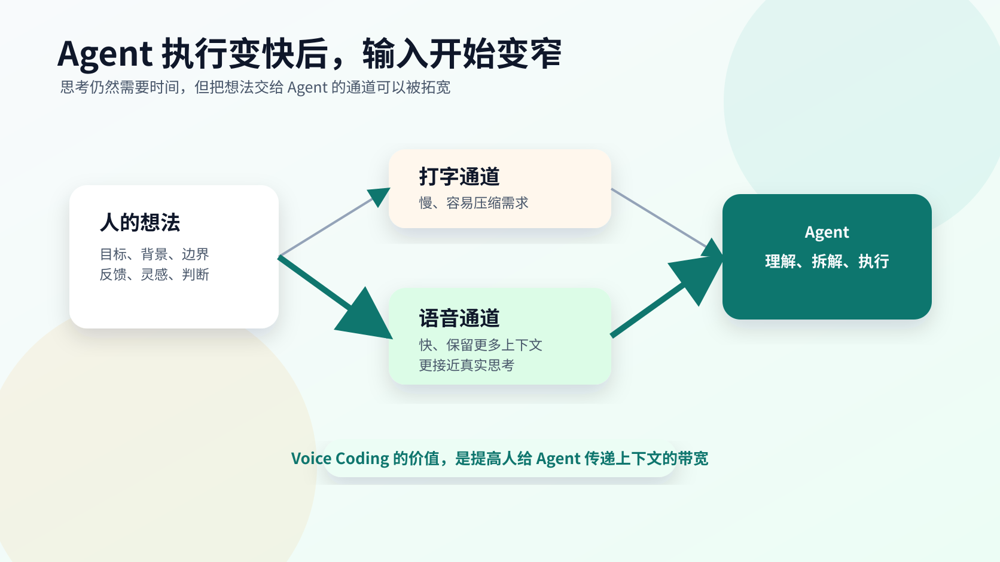
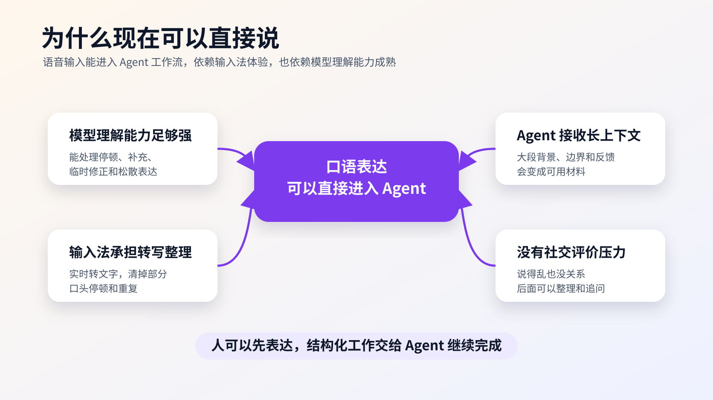
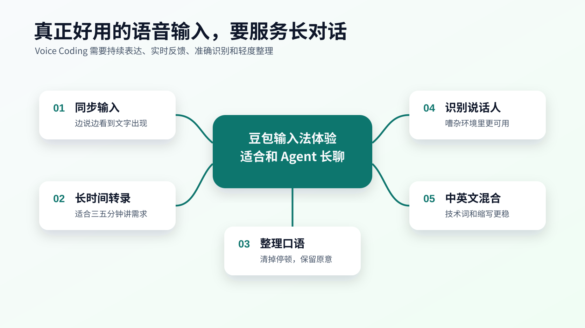
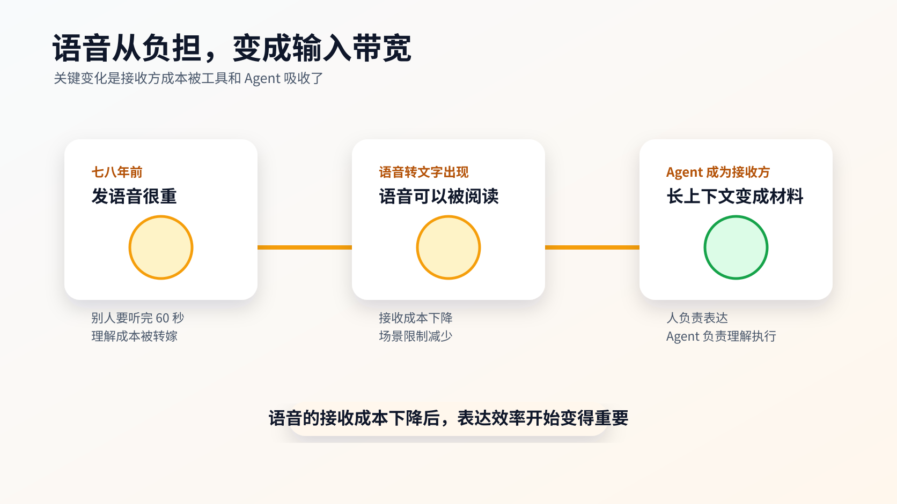
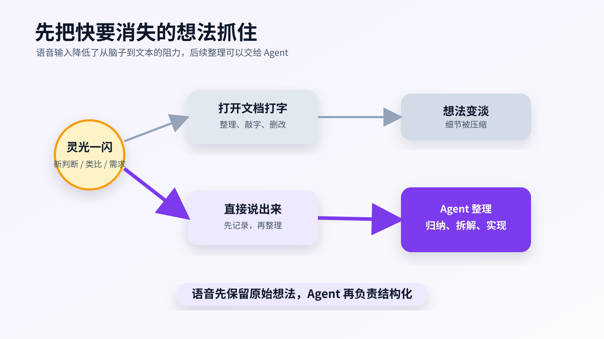

# Voice Coding 是先进生产力工具

我最近基本放弃打字了。

更准确一点说，能说话的时候，我都会直接用语音输入。现在我在用豆包输入法，跟 Agent 沟通、整理想法、写文章素材、补充需求，很多内容都直接说出来，然后让它转成文字。

这件事听起来很小，但用了一段时间以后，我的感受非常明确。

Voice Coding 这件事，可能会成为 Agent 时代一个很重要的交互变化。

之前 `vibe coding` 这个词很火，大家讨论的是人用自然语言、感觉和意图去驱动 Agent 写代码。现在我越来越觉得，下一步很自然会走到 `voice coding`。因为当 Agent 已经能理解大段自然语言，能拆任务、改代码、跑验证、写文档时，人和 Agent 之间真正卡住的地方，经常已经不在模型能力上。

卡在人的输入速度上。

## 打字开始变成新的瓶颈

Agent 现在的能力已经非常强了。

它可以读项目、理解上下文、生成代码、修改文件、跑命令、总结结果，也可以根据人的反馈继续迭代。很多时候，一个需求真正慢下来的地方，已经转移到人能不能把需求讲清楚。

这里面有两个瓶颈。

一个是思考。

人总要思考自己到底想做什么，边界在哪里，验收标准是什么，哪里不满意，下一步怎么改。这个效率短时间内很难大幅提升。思考本来就需要时间，也应该花时间。

另一个是输入。

这件事过去没有那么明显。因为以前写代码、写文档、做需求，主要劳动就在我们自己身上。打字只是完成工作的一部分。到了 Agent 协作场景里，很多执行工作交给 Agent 之后，打字突然变成了人把想法交给 Agent 的主要通道。

于是问题来了。

人的想法形成得很快，嘴上表达也很快，但手打字很慢。

尤其是跟 Agent 沟通时，我们经常需要输入很长的上下文。要讲背景，要讲目标，要讲不满意的地方，要讲边界，要讲自己临时想到的补充。靠手敲这些内容，很容易敲着敲着就烦了，最后只写出一个很短的、被压缩过的需求。

需求一压缩，Agent 就只能猜。

Agent 一猜，后面就容易跑偏。

所以我现在越来越觉得，语音输入对 Agent 协作的价值，已经超过了单纯的提速。它会改变人表达需求的形态。

## 为什么现在可以直接说

这里还有一个前提很重要。

我们今天敢用语音输入和 Agent 沟通，是因为模型和 Agent 的理解能力已经足够强。

以前用语音输入，大家会担心一个问题：口语表达太散了。人说话时会有停顿、重复、临时修正和前后补充，很多句子并没有严格的书面结构。这样的内容如果交给一个能力弱的系统，它可能理解不了，甚至会把临时修正也当成正式指令。

现在的 Agent 已经能处理大量自然语言里的不完整表达。

你用口语说一段需求，或者把同样的意思整理成书面文字，对它来说，很多时候理解到的核心含义差不多。只要目标、边界和关键限制表达出来，它就能从上下文里推断你的意图。

这件事改变了语音输入的地位。

过去语音输入更像一种偷懒方式，转出来的文字还要人重新整理。现在它可以直接成为人和 Agent 之间的高带宽输入通道。因为 Agent 本身有能力从口语材料里提取结构，识别重点，理解补充和修正。

还有一点也很重要。

面对人说话时，我们会担心自己表达得不好。说得啰嗦，会不会显得没条理；说错了再改，会不会让别人不耐烦；说了一大段，对方会不会觉得负担很重。

面对 Agent 时，这些压力会小很多。

它不会评价你的口语表达是否体面，也不会因为你说得乱就对你有看法。你只是在向它传递信息。表达过程中有停顿、有修正、有重复，都很正常。后面可以让它整理，也可以继续追问补全。

这会让人更愿意把还没完全成形的想法先倒出来。

当然，现实里还有一点小尴尬。

我在公司上班时用语音输入，还是会担心旁边同事用奇怪的眼神看我。毕竟一个人在工位上对着电脑说一大段需求，看起来多少有点不寻常。

但这个体验太舒服了。

即使有一点尴尬，我现在还是愿意继续用语音输入。因为它确实让我更容易把想法完整地传给 Agent，也让我更少因为懒得打字而压缩表达。

## 豆包输入法让我真正用起来了

先说清楚，这篇没有广告合作。我只是自己用了一段时间，发现它非常适合跟 Agent 交互。

我之前也试过一些语音输入方式，但很多体验都差一点。

有些输入法是你先说一句话，说完以后它再转录，然后把文字一次性放出来。这个方式适合短句，适合搜索，适合随手回一句消息。但它不太适合跟 Agent 说需求。

因为跟 Agent 交流时，我经常需要讲很长一段。

我可能说着说着停一下，想一想，然后继续说。也可能前面先讲背景，中间突然想到一个边界，再补一句。甚至很多时候，我是在一边说，一边组织自己的想法。

这种场景下，豆包输入法有几个点让我很舒服。

### 同步输入

它会在我说话的同时，把前面说过的内容实时转成文字。

这个体验非常关键。

我不需要等整段话说完，也不需要一直猜它有没有识别对。我可以一边说，一边看文字慢慢出现。如果发现方向大体对，就继续往下讲；如果发现某个词识别错了，后面也可以马上补充说明。

这会让语音输入变得更像真正的输入法，单纯的“录音转文字”很难达到这种手感。

跟 Agent 交互时，实时反馈非常重要。因为我并没有在朗读一段已经写好的稿子，我是在生成想法。文字同步出现，会让我更容易保持表达节奏。

### 长时间转录

豆包输入法另一个让我很喜欢的点，是它支持长时间转录。

很多语音输入需要长按按钮。你按住，说话，松开，然后它输出。这个设计在短消息里没有问题，但对长需求非常不友好。

你跟 Agent 讲一个复杂需求时，可能要说三分钟、五分钟，甚至更久。一直按着语音键，本身就会打断思考。手还被占住，注意力也被占住。

豆包输入法可以点一下按钮，然后进入持续记录状态。这个细节看起来不大，但体验差别很明显。

我可以把注意力放在要表达的内容上，不需要频繁操作输入法。它像一个一直开着的记录器，我只要继续把想法讲出来。

这点很适合 Agent 协作。

因为很多需求就是在表达过程中逐渐成形的。人很少一开始就把所有东西想完整。更多时候，我们是说着说着才意识到，还要补一个约束，还要解释一个背景，还要强调一个不能做的事情。

长时间转录给了这个过程足够的空间。

### 会整理口语，但不会吃掉意思

人说话的时候，表达经常很散。

会有停顿，会有重复，会有“啊”“嗯”“不对”“我刚才说错了”这种临时修正。口语本来就这样。它比书面表达更接近思考过程，也更混乱。

豆包输入法让我觉得舒服的地方，是它会在一定程度上整理这些口语。

它会把很多语气词、重复和明显的口头停顿处理掉，让输出更接近可读文字。但它没有把我真正要表达的内容随便改写掉。

这一点很重要。

如果语音输入法完全照搬口语，结果会很乱。你说出来的内容可能一大段全是停顿、重复和临时修正，Agent 读起来也会吃力。

如果语音输入法过度改写，它又可能把你的原意改掉。尤其是你在讲需求边界、技术限制、实现细节时，随便润色会很危险。

我目前的感受是，豆包在这个尺度上拿捏得不错。它会让文字更干净，但不会替你重新写一篇完全不同的东西。

### 识别说话人

还有一个点我一开始没想到。

有一次我在相对嘈杂的环境里用豆包输入法，旁边有人路过，也有人在说话。我本来以为它会把周围声音一起收进去，结果发现被记录下来的基本只有我自己的声音。

这件事给我的感觉很强。

因为语音输入要真正进入日常使用，环境适应能力很关键。我们不可能永远坐在安静房间里，戴着麦克风，像录播客一样跟 Agent 说话。很多时候我们就是在办公室、在路上、在比较随意的场景里突然想到一个点。

如果输入法能稳定识别说话人，把环境里的其他声音过滤掉，语音输入的使用边界就会扩大很多。

它会从“我在特定环境下才能用”，变成“我随手就能用”。

### 中英文混合识别很准

还有一点非常适合技术场景。

我说话时经常中英文混在一起。比如 `vibe coding`、`Codex`、`GPT`、`Agent`、`MCP`、`review`、`mock` 这些词，经常会直接夹在中文句子里。

很多语音识别在这种地方会翻车。它可能听出一个发音相近但完全不相关的词，后面你还要手动修。

豆包输入法在这块的识别率让我挺惊讶。它会根据上下文判断我在说哪个概念。技术词、英文缩写、中文语境混在一起时，它经常能选到最合适的那个词。

这对 Voice Coding 很关键。

因为程序员和 Agent 沟通时，不会说纯中文，也不会说纯英文。真实表达就是混合的。工具名、变量名、模型名、概念名都会夹在一起。

输入法如果处理不好这些词，语音输入就会变成另一种修错负担。识别足够准之后，人才会愿意长期使用。

## 发语音曾经是一件很不礼貌的事

说到语音输入，我突然想到一个很有意思的变化。

大概七八年前，很多人对发语音消息是很反感的。

那个时候经常有一个说法，发一条 60 秒语音给别人，别人就要花 60 秒听完。你如果说得不清楚，环境音又嘈杂，对方还得更认真地听。一个人在群里发一段语音，可能十几个人、几十个人都要分别花时间理解。

所以那时候很多人会觉得，发语音是一种把自己的表达成本转嫁给别人的行为。

更尊重人的方式，是自己多花一点时间，把内容打成文字，把错别字改掉，把逻辑整理清楚。这样别人读起来更快，也更容易引用、搜索和转发。

这个观念在当时是对的。

后来事情开始变化。

微信这类产品开始支持语音转文字。别人发来一段语音，你不方便听，也可以点一下转文字，大概知道他说了什么。这个功能解决了很多问题。

它把“语音消息必须被听完”这件事，变成了“语音也可以被阅读”。

这一步很关键。

语音原本的缺点，是接收方要承担太多理解成本。转文字功能出现之后，发送方可以用更自然的方式表达，接收方也可以用更高效的方式阅读。

到了 Agent 这里，变化更进一步。

接收方已经变成了 Agent。

你不用担心它听 60 秒会烦，也不用担心它花精力阅读长文本。它真正需要的，是足够多、足够真实、足够明确的上下文。

这就让语音输入的价值被重新放大。

过去我们为了尊重人，应该把语音整理成文字。现在输入法已经能帮我们完成这一步。人负责表达，工具负责转写和轻度整理，Agent 负责理解和执行。

整个链条突然顺了起来。

## 语音能抓住那些快要消失的想法

还有一个点，我觉得比效率更重要。

人脑子里真正产生的东西，和最后写出来的东西，中间差距很大。

很多时候，你脑子里有一团很丰富的想法。它可能有情绪，有画面，有几个还没连起来的判断，有一个突然冒出来的类比。你当时觉得这个点很有意思，但如果没有马上记录，很快就消失了。

我经常遇到这种情况。

脑子里突然闪过一个很好的表达，或者一个很有意思的判断。我知道它有价值，但如果让我打开文档，切到输入框，开始打字，等我真的敲下第一句话时，那个东西已经变淡了。

写字需要整理。

整理当然重要，但整理也会消耗时间。就在这几秒、十几秒里，灵感可能已经从一个很鲜活的东西，变成一个模糊的影子。

语音输入在这个地方很有优势。

你可以先说出来。

不用先组织得很漂亮，也不用先想清楚开头怎么写。只要把那个还热着的念头说出来，它就被记录下来了。后面可以再整理、再删减、再交给 Agent 帮你结构化。

Voice Coding 对我来说，最爽的地方也在这里。

它降低了“把想法从脑子里搬出来”的阻力。

很多东西，如果要求我打字，我可能会懒得写，或者写到一半就压缩掉。用语音说出来以后，它会自然保留更多细节。包括犹豫、补充、临时想到的例子、突然冒出来的判断。

这些细节对 Agent 很有价值。

因为 Agent 会综合你的完整表达来理解意图。你的偏好、边界和语气都会进入上下文。你给它的材料越丰富，它越容易知道你到底想要什么。

## 跟 Agent 聊天，从打字变成打电话

我现在对 Voice Coding 的感受，可以用一个很简单的类比来说。

以前我跟 Agent 交流，有点像在 QQ 上跟一个网友打字聊天。

你要坐下来，打开输入框，组织语言，敲字，删改，再发送。这个过程当然也能沟通，但它有一种明显的输入阻力。很多想法会在打字前被压缩，很多细节会因为麻烦被省略。

现在用了语音输入以后，它更像打电话。

我可以把想法直接说出来。想到哪里说到哪里，发现前面有点不准确，就马上补一句。讲着讲着又想到一个边界，也可以立刻加进去。

这种交互方式更接近人真实思考的形态。

尤其是跟 Agent 这种对象交流时，语音的优势会更明显。因为 Agent 不会被你的长篇表达累到，它反而需要更多上下文。你说得越完整，它越容易判断你的真实意图。

当然，这不代表所有内容都适合语音。

有些地方仍然需要手动编辑。比如精确变量名、代码片段、最终发布文案、复杂表格、需要逐字控制的表达。这些内容用键盘处理更稳。

但在需求沟通、想法整理、问题描述、反馈修改、文章素材收集这些场景里，语音输入已经非常好用。

它让人与 Agent 的交互从“输入命令”，更接近“持续沟通”。

## Voice Coding 可能会成为新的基础能力

我现在越来越觉得，语音输入和 Agent 的结合，会成为一个很自然的趋势。

过去我们强调 prompt，强调怎么写出更清楚的指令。这个方向当然还重要。但在我最近的体验里，输入方式本身也开始变得重要。

当 Agent 能力不够强时，你说再多也没用。它理解不了，也执行不了。

当 Agent 能力逐渐变强，人的表达带宽就变得越来越重要。

键盘是一种带宽。

语音也是一种带宽。

以前键盘更可靠，因为语音识别不够准，转写不够好，环境噪声太麻烦。现在识别率、实时转写、长时间转录、说话人识别、口语整理这些能力逐渐成熟，语音输入的使用体验突然到了一个可用的位置。

这个变化会影响很多事情。

写代码前描述需求，可以说。

review 之后指出问题，可以说。

写文章前倾倒素材，可以说。

想到一个产品点子，可以先说。

工作中需要记录临时判断，也可以先说。

真正重要的，是先把想法抓住。

后面再让 Agent 帮你整理、归纳、拆解、实现、验证。

## 结尾

我以前真的没想到，有一天打字会成为产出效率的瓶颈。

更没想到的是，解决这个瓶颈的方式，竟然是重新回到最自然的人类表达方式：说话。

Agent 让很多执行工作变快了。代码可以生成，文档可以整理，方案可以扩展，验证可以循环。人的价值越来越集中到思考、判断、品味、目标定义和持续反馈上。

在这个变化里，语音输入像是把人的思考和 Agent 的执行之间那条管道拓宽了。

我现在用 Voice Coding 最大的感受，就是跟 Agent 之间的距离变短了。

以前我要先把脑子里的东西压缩成一段文字，再发给它。现在我可以更直接地把想法说出来，让它接住，再一起往下推进。

这种体验确实很爽。

而且我觉得，这可能只是开始。
